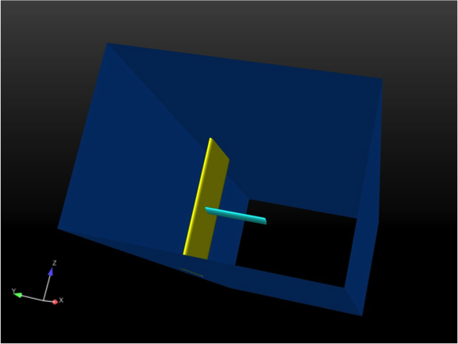
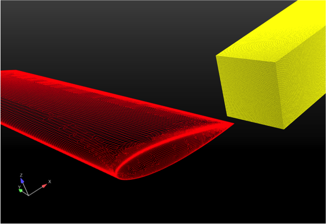

McAlister wing simulations
^^^^^^^^^^^^^^^^^^^^^^^^^^

Simulations of `the McAlister and Takahashi (1991) NACA0015 experiment
<http://www.dtic.mil/cgi-bin/GetTRDoc?AD=ADA257317>`_ were performed
to establish baseline Nalu turbulence modeling and solver
capabilities.

Experimental setup
""""""""""""""""""

The experiments were performed in the NASA Ames 7 by 10 foot Subsonic
Wind Tunnel No. 2. The wings tested were semispan NACA0015 wings
without twist or taper. These were mounted on a splitter plate
extending from floor to ceiling and positioned about 1ft away from the
side wall. Wings with different aspect ratios, chord lengths, angle of
attacks, and tip types (square or rounded) were instrumented to study
pressure, lift, and drag coefficients at different Reynolds
numbers. Additionally, wing tip vorticies characteristics were
measured using a laser-velocimeter system and a rapid-scan technique
for capturing velocity profiles.

Simulation description
""""""""""""""""""""""

Nalu was used to perform simulations of the :math:`Re = 1.5 \times
10^6` case with a :math:`12^\circ` angle of attack, a 1ft chord
length, 3.3 aspect ratio, and a rounded wing tip. To accurately model
the experimental setup, the mesh geometry contains the tunnel walls,
splitter plate (wall mount), and the half-span wing. The full domain
size is 30ft in `x` (downstream direction), 10ft in :math:`y`
(spanwise direction), and 7ft in :math:`z` (vertical direction). The
tunnel inlet, wing boundary layer region, and wing tip vortex region
were all discretized using hexahedra. The rest of the domain was
discretized with tetrahedra. The mesh is fully conformal. Boundary
conditions on the wing, splitter plate, and the walls are set to
no-slip wall boundary conditions. The tunnel inlet is an inflow
boundary condition. The tunnel outlet is an open boundary condition.

		    
	    Test geometry with wind tunnel side walls (blue),  wing (cyan), and splitter plate (yellow).

		    
	    Mesh near wing (red) and tip vortex mesh region (yellow).

The turbulence modeling framework is DES, a hybrid RANS-LES framework,
with SST as the RANS model and Smagorinsky as the LES
model. Implementation details of the turbulence modeling can be found
in the Nalu theory documentation (:ref:`turbulence_modeling` and
:ref:`sst_rans_model`).

Results
"""""""

Results to come
