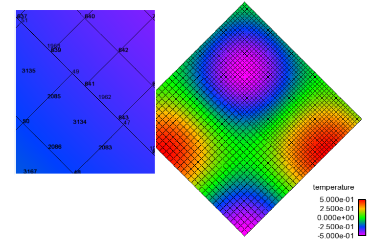
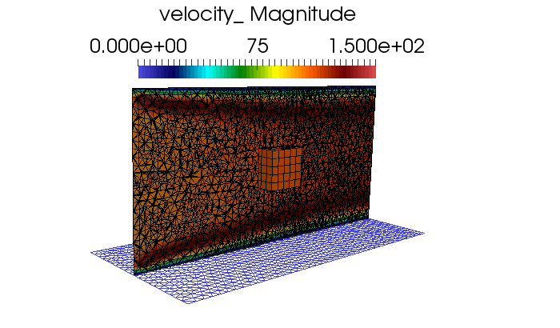

Supported Boundary Conditions
-----------------------------

Inflow Boundary Condition
+++++++++++++++++++++++++

Continuity
~~~~~~~~~~

Continuity uses a flux boundary condition with the incoming mass flow
rate based on the user specified values for velocity,

.. math:: \dot{m}_c = \rho^{spec} u^{spec}_j A_j.

As this is a vertex-based code, at inflow and Dirichlet wall boundary
locations, the continuity equation uses the specified velocity within
the inflow boundary condition block.

Momentum, Mixture Fraction, Enthalpy, Species, :math:`k_{sgs}`, k and :math:`\omega`
~~~~~~~~~~~~~~~~~~~~~~~~~~~~~~~~~~~~~~~~~~~~~~~~~~~~~~~~~~~~~~~~~~~~~~~~~~~~~~~~~~~~

These degree-of-freedoms (DOFs) each use a Dirichlet value with the
specified user value. For all Dirichlet values, the row is zeroed with a
unity placed on the diagonal. The residual is zeroed and set to the
difference between the current value and user specified value.

Wall Boundary Conditions
++++++++++++++++++++++++

Continuity
~~~~~~~~~~

Continuity uses a no-op.

Momentum
~~~~~~~~

When resolving the boundary layer, Momentum again uses a no-slip
Dirichlet condition., e.g., :math:`u_i = 0`.

In the case of a wall model, a classic wall function is applied. The
wall shear stress enters the discretization of the momentum equations by
the term

.. math::
   :label: wall-shear1

   \int \tau_{ij} n_j dS = -{F_w}_i .

Wall functions are used to prescribe the value of the wall shear stress
rather than resolving the boundary layer within the near-wall domain.
The fundamental momentum law of the wall formulation, assuming
fully-developed turbulent flow near a no-slip wall, can be written as,

.. math::
   :label: law-wall

   u^+ = \frac{u_{\|}}{u_{\tau}} 
       = \frac{1}{\kappa} \ln \left(Ey^+\right) ,

where :math:`u^+` is defined by the the near-wall parallel velocity,
:math:`u_{\|}`, normalized by the wall friction velocity,
:math:`u_{\tau}`. The wall friction velocity is related to the turbulent
kinetic energy by,

.. math::
   :label: utau

   u_{\tau} = C_\mu^{1/4} k^{1/2}.

by assuming that the production and dissipation of turbulence is in
local equilibrium. The wall friction velocity is also computed given the
density and wall shear stress,

.. math:: u_\tau = (\frac{\tau_w} {\rho})^{0.5}.

The normalized perpendicular distance from the point in question to the
wall, :math:`y^+`, is defined as the following:

.. math::
   :label: yplus

   y^+ = \frac{ \rho Y_p}{\mu }\left(\frac{\tau_w}{\rho} \right)^{1/2} 
       = \frac{ \rho Y_p u_{\tau}} {\mu }.

The classical law of the wall is as follows:

.. math::
   :label: lawOfWall1

   u^+ = \frac{1}{\kappa} \ln(y^+) + C,

where :math:`\kappa` is the von Karman constant and :math:`C` is the
dimensionless integration constant that varies based on authorship and
surface roughness. The above expression can be re-written as,

.. math::
   :label: lawOfWall2

   u^+ = \frac{1}{\kappa} \ln(y^+) + \frac{1}{\kappa} \ln(\exp(\kappa C)),

or simplified to the following expression:

.. math::
   :label: lawOfWall3

   u^+ &= \frac{1}{\kappa} \left(\ln(y^+) + \ln(\exp(\kappa C))\right) \\
   &= \frac{1}{\kappa} \ln(E y^+).

In the above equation, :math:`E`, is referred to in the text as the
dimensionless wall roughness parameter and is described by,

.. math::
   :label: ElogParam

   E = \exp(\kappa C).

In Nalu, :math:`\kappa` is set to the value of 0.42 while the value of
:math:`E` is set to 9.8 for smooth walls (White suggests values of
:math:`\kappa=0.41` and :math:`E=7.768.`). The viscous sublayer is
assumed to extend to a value of :math:`y^+` = 11.63.

The wall shear stress, :math:`\tau_w`, can be expressed as,

.. math::
   :label: wall-shear-trb

   \tau_w = \rho u_\tau^2 = \rho u_\tau {\frac{u_\|} {u^+}}
          = \frac{\rho \kappa u_{\tau}}{\ln \left(Ey^+\right) } u_\|
          = \lambda_w u_\| ,

where :math:`\lambda_w` is simply the grouping of the factors from the
law of the wall. For values of :math:`y^+` less than 11.63, the wall
shear stress is given by,

.. math::
   :label: wall-shear-lam

   \tau_w =  \mu \frac{u_\|}{Y_p} .

The force imparted by the wall, for the :math:`i_{th}` component of
velocity, can be written as,

.. math::
   :label: wall-force-1

   F_{w,i}= -\lambda_w A_w u_{i\|} ,

where :math:`A_w` is the total area over which the shear stress acts.

The use of a general, non-orthogonal mesh adds a slight complexity to
specifying the force imparted on the fluid by the wall. As shown in
Equation :eq:`wall-force-1`, the velocity component parallel to the wall
must be determined. Use of the unit normal vector, :math:`n_j`, provides
an easy way to determine the parallel velocity component by the
following standard vector projection:

.. math::
   :label: proj-oper

   \Pi_{ij} = \left [ \delta_{ij} - n_i n_j \right].

Carrying out the projection of a general velocity, which is not
necessarily parallel to the wall, yields the velocity vector parallel to
the wall,

.. math::
   :label: proj-operU

   u_{i\|} = \Pi_{ij} {u}_j = u_i\left(1-{n_i}^2\right)
           -\sum_{j=1;j\neq j}^{n} u_j n_i n_j.

Note that the component that acts on the particular :math:`i^{th}`
component of velocity,

.. math::
   :label: implicit-shear

   -\lambda_w A_w \left(1-n_i n_i\right) u_{i\|} ,

provides a form that can be potentially treated implicitly; i.e., in a
way to augment the diagonal dominance of the central coefficient of the
:math:`i^{th}` component of velocity. The use of residual form adds a
slight complexity to this implicit formulation only in that appropriate
right-hand-side source terms must be added.

Mixture Fraction
~~~~~~~~~~~~~~~~

If a value is specified for each quantity within the wall boundary
condition block, a Dirichlet condition is applied. If no values are
specified, a zero flux condition is applied.

Enthalpy
~~~~~~~~

If the temperature is specified within the wall boundary condition
block, a Dirichlet condition is always specified. Wall functions for
enthalpy transport have not yet been implemented.

The simulation tool supports multi-physics coupling via conjugate heat
transfer and radiative heat transfer. Coupling parameters required for
the thermal boundary condition are post processed by the fluids or PMR
Realm. For conjugate and radiative coupling, the thermal solve provides
the surface temperature. From the surface temperature, a wall enthalpy
is computed and used.

Thermal Heat Conduction
~~~~~~~~~~~~~~~~~~~~~~~

If a temperature is specified in the wall block, and the surface is not
an interface condition, then a Dirichlet approach is used. If conjugate
heat transfer is included, then the boundary condition applied is as
follows,

.. math:: -\kappa \frac{\partial T} {\partial x_j} n_j dS = h(T-T^o)dS,

where :math:`h` is the heat transfer coefficient and :math:`T^o` is the
reference temperature. The details of how these quantities are computed
are currently omitted in this manual. In general, the quantities are
post processed from the fluids temperature field. A surface-based
gradient is computed on the boundary face. Nodes on the face augment a
heat transfer coefficient field while nodes off the face contribute to a
reference temperature.

For radiative heat transfer, the boundary condition applied is as
follows:

.. math:: -\kappa \frac{\partial T} {\partial x_j} n_j dS = \epsilon (\sigma T^4 - H) dS,

where :math:`H` is again the irradiation provided by the RTE solve.

If no temperature is specified or an adiabatic line command is used, a
zero flux condition is applied.

Species
~~~~~~~

If a value is specified for each quantity within the wall boundary
condition block, a Dirichlet condition is applied. If no values are
specified, a zero flux condition is applied.

Atmospheric Boundary Layer Surface Conditions
+++++++++++++++++++++++++++++++++++++++++++++

Monin-Obukhov Theory
~~~~~~~~~~~~~~~~~~~~

Consider atmospheric flow over a flat but non-smooth surface; the
coordinate system convention is that flow is along the :math:`x`-axis, while
the :math:`z`-axis is oriented normal to the surface.  The surface layer is
the relatively thin layer near the surface where strong wind and
temperature gradients exist.  Turbulence within this layer can be
generated through mechanisms of both shear and thermal convection; the
relative contributions of these two mechanisms is determined by the
stability state of the atmosphere.  The stability state is
characterized by the Monin-Obukhov length:

.. math::

   L = - \frac{u_\tau^3 \theta_{ref}}{\kappa g (\overline{w^\prime
     \theta^\prime})_s};

:math:`u_\tau` is the friction velocity, defined as the
square root of the magnitude of the Reynolds shear stress at
the surface, or

.. math::

   u_\tau = \left( \overline{w^\prime u^\prime}^2 + \overline{w^\prime
   v^\prime}^2 \right)^{1/4} = \sqrt{\frac{\tau_s}{\rho_s}}

:math:`\theta_{ref}` is a reference (virtual potential) temperature associated with the air
within the surface layer; for example, the average temperature within
the surface layer.  :math:`\kappa \approx 0.41` is the von Karman constant,
and :math:`g` is the acceleration of gravity.  :math:`\overline{w^\prime \theta^\prime}_s`
is the surface turbulent temperature flux.  Both the
turbulent shear stress and turbulent temperature flux are approximately
constant within the surface layer.

Applying a gradient diffusion model for the turbulent temperature flux leads to:

.. math::

   \overline{w^\prime \theta^\prime}_s = -k_T \frac{\partial \theta}{\partial z}

The sign of :math:`L` is then connected to the sign of the temperature
gradient within the surface layer.  Three regimes are delineated:

* :math:`\frac{1}{L} > 0, \quad \frac{\partial \theta}{\partial z} > 0`, stable stratification
* :math:`\frac{1}{L} = 0, \quad \frac{\partial \theta}{\partial z} = 0`, neutral stratification
* :math:`\frac{1}{L} < 0, \quad \frac{\partial \theta}{\partial z} < 0`, unstable stratification

Monin-Obukhov theory postulates the following similarity laws for mean
velocity parallel to the surface and temperature,

.. math::
   :label: dudz

   \frac{\kappa z}{u_\tau}\frac{\partial \overline{u}_{||}}{\partial z} =
   \phi_m\left(\frac{z}{L}\right),

.. math::
   :label: dTdz

   \frac{\kappa z u_\tau}{\overline{w^\prime \theta^\prime}_s}
   \frac{\partial \overline{\theta}}{\partial z} = \phi_h\left(\frac{z}{L}\right),

where the forms of the non-dimensional functions :math:`\phi_m` and :math:`\phi_h` are determined
from empirical observations. Analytical functions have been fit to the
data; these are not given here, rather, we present the integrated form
of (:eq:`dudz`) and (:eq:`dTdz`), since these are the forms required
by the code implementation.

For neutral stratification, :math:`\phi_m = 1` and we recover the
logarithmic profile for a "fully rough" surface,

.. math::
   :label: vel_neutral

   \overline{u}_{||}(z) = \frac{u_\tau}{\kappa}\ln\frac{z}{z_0},

where :math:`z_0` is the characteristic roughness height.  Note that viscous
scaling involving surface viscosity and density properties is not
required with this form of the logarithmic profile, since the
roughness height is large enough to eliminate the presence of a
laminar sublayer and buffer layer.

For stable stratification, the surface layer profiles take the form

.. math::
   :label: vel_stable

   \overline{u}_{||}(z) = \frac{u_\tau}{\kappa}\left(\ln\frac{z}{z_0} +
   \gamma_m\frac{z}{L}\right)

.. math::
   :label: temp_stable

   \overline{\theta}(z) = \overline{\theta}(z_0) +
   \frac{\theta_*}{\kappa} \left(\alpha_h\ln\frac{z}{z_0} +
   \gamma_h\frac{z}{L}\right)

:math:`\theta_*` is calculated from the temperature flux and friction velocity as
:math:`\theta_* = -\frac{\overline{w^\prime \theta^\prime}_s}{u_\tau}`, and
:math:`\gamma_m`, :math:`\alpha_h`, and :math:`\gamma_h` are constants specified below.

For unstable stratification, the surface layer profiles take the form

.. math::
   :label: vel_unstable

   \overline{u}_{||}(z) = \frac{u_\tau}{\kappa}\left(\ln\frac{z}{z_0} -
   \psi_m\left(\frac{z}{L}\right)\right)

.. math::
   :label: temp_unstable

   \overline{\theta}(z) = \overline{\theta}(z_0) +
   \alpha_h\frac{\theta_*}{\kappa}\left(\ln\frac{z}{z_0} -
   \psi_h\left(\frac{z}{L}\right)\right)

where

.. math::
   :label: psi_m

   \psi_m\left(\frac{z}{L}\right) = 2\ln\frac{1 + x}{2}
   + \ln\frac{1 + x^2}{2} - 2\tan^{-1}x +
   \frac{\pi}{2}, \quad x = \left(1 - \beta_m\frac{z}{L}\right)^{1/4},

.. math::
   :label: psi_h

   \psi_h\left(\frac{z}{L}\right) = \ln\frac{1 + y}{2}, \quad y = \left(1 -
   \beta_h\frac{z}{L}\right)^{1/2}.

The constants used in (:eq:`vel_stable`) -- (:eq:`psi_h`) are :cite:`Dyer:74`

.. math::

   \kappa = 0.41,~~\alpha_h =
   1,~~\beta_m=16,~~\beta_h=16,~~\gamma_m=5.0,~~\gamma_h=5.0.

.. _theory_abl_wall_function:

ABL Wall Function
~~~~~~~~~~~~~~~~~

The equations from the preceeding section can be used to formulate a
wall function boundary condition for simulation of atmospheric
boundary layers.  The user-specified inputs to this boundary condition
are: roughness length, :math:`z_0`, and surface heat flux, :math:`q_s =
\rho C_p (\overline{w^\prime \theta^\prime})_s`.  The surface layer profile
model is evaluated for each surface boundary flux integration point;
the wall-normal distance of the "first point off the wall" is taken
to be one fourth of the length of the nearest edge intersecting the
boundary face.  The boundary condition is specified weakly through the
imposition of a surface shear stress and surface heat flux.

The procedure for applying the boundary condition is as follows:

1. Determine the stratification state of the boundary layer by calculating the sign of the Monin-Obukhov length scale.
2. Solve the appropriate profile equation, either (:eq:`vel_neutral`), (:eq:`vel_stable`), or (:eq:`vel_unstable`), for the friction velocity :math:`u_\tau`.  For the neutral case, :math:`u_\tau` can be solved for directly.  For the stable and unstable cases, :math:`u_\tau` must be solved for iteratively because :math:`L` appears in these equations and :math:`L` depends on :math:`u_\tau`.
3. The surface shear stress is calculated as :math:`\tau_s = \rho_s u_\tau^2`.  For calculating left-hand-side Jacobian entries, the form :eq:`tau_s_useful` is used, where :math:`\psi^\prime` is zero for a neutral profile, :math:`-\gamma_m z/L` for a stable profile, and :math:`\psi_h(z/L)` for an unstable profile. The Jacobian entries follow directly from this form.
4. The user specified surface heat flux is applied to the enthalpy equation. Evaluation of surface temperature is not required for the boundary condition specification. However, if surface temperature is required for evaluation of other quantities within the code, the appropriate surface layer temperature profile should be used, either (:eq:`temp_stable`) or (:eq:`temp_unstable`).

.. math::
   :label: tau_s_useful

   \tau_{s_i} = \lambda_s u_{||_i} = \frac{\kappa\rho u_\tau}{\log(z/z_0) - \psi^\prime (z/L)},

Turbulent Kinetic Energy, :math:`k_{sgs}` LES model
+++++++++++++++++++++++++++++++++++++++++++++++++++

When the boundary layer is assumed to be resolved, the natural boundary
condition is a Dirichlet value of zero, :math:`k_{sgs} = 0`.

When the wall model is used, a standard wall function approach is used
with the assumption of equal production and dissipation.

The turbulent kinetic energy production term is consistent with the law
of the wall formulation and can be expressed as,

.. math::
   :label: wall-pk-1

   {P_k}_w = \tau_w \frac{\partial u_{\|}}{\partial y}.

The parallel velocity, :math:`u_{\|}`, can be related to the wall shear
stress by,

.. math::
   :label: tauwall-uplus

   \tau_w \frac{u^+}{y^+} = \mu \frac{u_{\|}}{Y_p}.

Taking the derivative of both sides of Equation :eq:`tauwall-uplus`, and
substituting this relationship into Equation :eq:`wall-pk-1` yields,

.. math::
   :label: wall-pk-2

   {P_k}_w = \frac{\tau_w^2} {\mu} \frac{\partial u^+}{\partial y^+}.

Applying the derivative of the law of the wall formulation,
Equation :eq:`law-wall`, provides the functional form of
:math:`{\partial u^+ / \partial y^+}`,

.. math::
   :label: dlaw-wall

   \frac{\partial u^+}{\partial y^+}
         = \frac{\partial} {\partial y^+}
          \left[\frac{1}{\kappa} \ln \left(Ey^+\right) \right]
         = \frac{1}{\kappa y^+}.

Substituting Equation :eq:`law-wall` within Equation :eq:`wall-pk-2` yields
a commonly used form of the near wall production term,

.. math::
   :label: wall-pk-3

   {P_k}_w = \frac{{\tau_w}^2}{\rho\kappa u_{\tau} Y_p}.

Assuming local equilibrium, :math:`P_k = \rho\epsilon`, and using
Equation :eq:`wall-pk-3` and Equation :eq:`utau` provides the form of wall
shear stress is given by,

.. math::
   :label: wall-tauw-equil

   \tau_w = \rho C_\mu^{1/2} k.

Under the above assumptions, the near wall value for turbulent kinetic
energy, in the absence of convection, diffusion, or accumulation is
given by,

.. math::
   :label: wall-tke

   k = \frac{u_\tau^2}{C_\mu^{1/2}}.

This expression for turbulent kinetic energy is evaluated at the
boundary faces of the exposed wall boundaries and is area-assembled to
the nodal value for use in a Dirichlet condition.

Turbulent Kinetic Energy and Specific Dissipation SST Low Reynolds Number Boundary conditions
~~~~~~~~~~~~~~~~~~~~~~~~~~~~~~~~~~~~~~~~~~~~~~~~~~~~~~~~~~~~~~~~~~~~~~~~~~~~~~~~~~~~~~~~~~~~~

For the turbulent kinetic energy equation, the wall boundary conditions
follow that described for the :math:`k_{sgs}` model, i.e., :math:`k=0`.

A Dirichlet condition is also used on :math:`\omega`. For this boundary
condition, the :math:`\omega` equation depends only on the near-wall
grid spacing. The boundary condition is given by,

.. math::

   \omega = \frac{6 \nu} {\beta_1 y^{2}},

which is valid for :math:`y^{+} < 3`.

Turbulent Kinetic Energy and Specific Dissipation SST High Reynolds Number Boundary conditions
~~~~~~~~~~~~~~~~~~~~~~~~~~~~~~~~~~~~~~~~~~~~~~~~~~~~~~~~~~~~~~~~~~~~~~~~~~~~~~~~~~~~~~~~~~~~~~

The high Reynolds approach uses the law of the wall assumption and also
follows the description provided in the wall modeling section with only
a slight modification in constant syntax,

.. math::
   :label: wallModelTke

   k = \frac{u_{\tau}^{2}}{\sqrt{\beta^*}}.

In the case of :math:`\omega`, an analytic expression is known in the
log layer:

.. math:: \omega = \frac{u_{\tau}} {\sqrt{\beta^*} \kappa y},

which is independent of :math:`k`. Because all these expressions
require :math:`y` to be in the log layer, they should absolutely not be
used unless it can be guaranteed that :math:`y^{+} > 10`, and
:math:`y^{+} > 25` is preferable. Automatic blending is not currently
supported.

Solid Stress
~~~~~~~~~~~~

The boundary conditions applied are either force provided by a static
pressure,

.. math::
   :label: displacement

   F^n_i = \int \bar{P} n_i dS,

or a Dirichlet condition, i.e., :math:`u_i = u^{spec}_i`, on the
displacement field. Above, :math:`F^n_i` is the force for component
:math:`i` due to a prescribed [static] pressure.

Intensity
~~~~~~~~~

The boundary condition for each intensity assumes a grey, diffuse
surface as,

.. math::
   :label: intBc

   I\left(s\right) = \frac{1}{\pi} \left[ \tau \sigma T_\infty^4 
                     + \epsilon \sigma T_w^4
                     + \left(1 - \epsilon - \tau \right) K \right].

Open Boundary Condition
+++++++++++++++++++++++

Open boundary conditions require far more care. In general, open bcs are
assembled by iterating faces and the boundary integration points on the
exposed face. The parent element is also required since oftentimes
gradients are used (for momentum). For an open boundary condition the
flow can either leave or enter the domain depending on what the computed
mass flow rate at the exposed boundary integration point is.

Continuity
~~~~~~~~~~

For continuity, the boundary mass flow rate must also be computed. This
value is stored and used for the other equations that require advection.
The same formula is used for the pressure-stabilized mass flow rate.
However, the local pressure gradient for each boundary contribution is
based on the difference between the interior integration point and the
user-specified pressure which takes on the boundary value. The interior
integration point is determined by linear interpolation. For CVFEM, full
elemental averaging is used while in EBVC discretization, the midpoint
value between the nearest node and opposing node to the boundary
integration point is used. In both discretization approaches,
non-orthogonal corrections are required. This procedure has been very
important for stability for CVFEM tet-based meshes where a natural
non-orthogonality exists between the boundary and interior integration
point.

In rare use cases, the usage of the standard open boundary mass flow 
rate expression, which includes pressure contributions, is not appropriate
due to complex temperature/buoyancy specifications, e.g., what is commonly
seen in Bousinesq Atmospheric Boundary Layer (ABL), simulations. In these cases, 
a global correction algorithm is supported. Specifically, pressure terms are dropped 
at the open boundary mass flow rate expression
in favor or a pre-processing algorithm that uniformly distributes the 
continuity mass flow rate (and possible density accumulation) "error" over
the entire set of open boundary conditions. The global correction scheme
may perform well with single open boundary condition specification, e.g., 
multiple inflows with a single open location, however, it is to be avoided if the flow
leaving the domain is complex in that a simulation includes multiple open boundary
conditions. A complex situation might be an open jet with entrainment from the side 
(open boundary that allows for inflow) and a top open that allows for outflow. However,
a routine case might be a backward facing step with a single inflow, side periodic, top
wall and open boundary. Not that the ability for the continuity solve to be 
well conditioned may require an interior Dirichlet on pressure as the open pressure
specification for the global correction algorithm is lacking. In most cases,
a Dirichlet condition is not actually required as the NULL-space of the continuity
system may not be found in the solve.

Momentum
~~~~~~~~

For momentum, the normal component of the stress is subtracted out we
subtract out the normal component of the stress. The normal stress
component for component i can be written as :math:`F_k n_k n_i`. The
tangential component for component i is simply,
:math:`F_i - F_k n_k n_i`. As an example, the tangential viscous stress
for component x is,

.. math:: F^T_x = F_x - (F_x n_x + F_y n_y ) n_x,

which can be written in general component form as,

.. math:: F^T_i = F_i(1-n_i n_i) - \sum_{i!=j} F_j n_i n_j.

Finally, the normal stress contribution is applied based on the user
specified pressure,

.. math:: F^N_i = P^{Spec} A_i.

For CVFEM, the face gradient operators are used for the thermal stress
terms. For EBVC discretization, from the boundary integration point, the
nearest node (the “Right” state) is used as well as the opposing node
(the “Left” state). The nearest node and opposing node are used to
compute gradients required for any derivatives. This equation follows
the standard gradient description in the diffusion section with
non-orthogonal corrections used. In this formulation, the area vector is
taken to be the exposed area vector. Non-orthogonal terms are noted when
the area vector and edge vector are not aligned.

For advection, If the flow is leaving the domain, we simply advect the
nearest nodal value to the boundary integration point. If the flow is
coming into the domain, we simply confine the flow to be normal to the
open boundary integration point area vector. The value entrained can be
the nearest node or an upstream velocity value defined by the edge
midpoint value.

Mixture Fraction, Enthalpy, Species, :math:`k_{sgs}`, k and :math:`\omega` 
~~~~~~~~~~~~~~~~~~~~~~~~~~~~~~~~~~~~~~~~~~~~~~~~~~~~~~~~~~~~~~~~~~~~~~~~~~~

Open boundary conditions assume a zero normal gradient. When flow is
entering the domain, the far-field user supplied value is used. Far
field values are used for property evaluations. When flow is leaving the
domain, the flow is advected out consistent with the choice of interior
advection operator.

Symmetry Boundary Condition
+++++++++++++++++++++++++++

Continuity, Mixture Fraction, Enthalpy, Species, :math:`k_{sgs}`, k and :math:`\omega`
~~~~~~~~~~~~~~~~~~~~~~~~~~~~~~~~~~~~~~~~~~~~~~~~~~~~~~~~~~~~~~~~~~~~~~~~~~~~~~~~~~~~~~

Zero diffusion is applied at the symmetry bc.

Momentum
~~~~~~~~

A symmetry boundary is one that is described by removal of the
tangential stress. Therefore, only the normal component of the stress is
applied:

.. math:: F^n_x = (F_x n_x + F_y n_y ) n_x,

which can be written in general component form as,

.. math:: F^n_i = F_j n_j n_i.

Specified Boundary-Normal Temperature Gradient Option
~~~~~~~~~~~~~~~~~~~~~~~~~~~~~~~~~~~~~~~~~~~~~~~~~~~~~

The standard symmetry boundary condition applies zero diffusion at the 
boundary for scalar quantities, which effectively results in those scalars 
having a zero boundary-normal gradient.  There are situations, especially 
for atmospheric flows in which the user may desire a finite boundary-normal 
gradient of temperature.  For example, the atmospheric boundary layer is 
often simulated with a stably stratified capping inversion in which the
temperature linearly increases with height all the way to the upper 
domain boundary.  We apply symmetry conditions to this upper boundary for
momentum, but we specify the boundary-normal temperature gradient on this
boundary to match the capping inversion's gradient. 

This is an option in the symmetry boundary condition specification, which 
appears in the input file as:

.. code-block:: yaml

    - symmetry_boundary_condition: bc_upper
      target_name: upper
      symmetry_user_data:
        normal_temperature_gradient: -0.003

In this example, the temperature gradient normal to the symmetry boundary 
is set to -0.003 K/m, where the boundary-normal direction is pointed into 
the domain.

Nalu does not solve a transport equation for temperature directly, but 
rather it solves one for enthalpy. Therfore, the boundary-normal temperature 
gradient condition is applied internally in the code through application of 
a compatible heat flux,

.. math:: q_n = -\kappa_{eff} c_p \frac{\partial T}{\partial n}

where :math:`q_n` is the heat flux at the boundary, :math:`\kappa_{eff}` is 
the effective thermal diffusivity (the molecular and turbulent parts), 
:math:`c_p` is the specific heat, and :math:`\partial T / \partial n` is 
the boundary-normal temperature gradient.

Periodic Boundary Condition
+++++++++++++++++++++++++++

A parallel multiple-periodic boundary condition is supported. Mappings
are created between master/slave surface node pairs. The node pairs are
obtained from a parallel search and are expected to be unique. The node
pairs are used to map the slave global id to that of the master. This
allows the linear system to include matrix rows for only a subset of the
overall set of nodes. Moreover, a periodic assembly for assembled
quantities is managed via: :math:`m+=s` and :math:`s=m`, where :math:`m`
and :math:`s` are master/slave nodes, respectively. For each parallel
assembled quantity, e.g., dual volume, turbulence quantities, etc., this
procedure is used. Periodic boxes and periodic couette and channel flow
have been simulated in this code base. Tow forms of parallel searches
exist and are supported (one through the Boost TPL and another through
the STK Search module).

Non-conformal Boundary Condition
++++++++++++++++++++++++++++++++

A surface-based approach based on a DG method has been discussed in the
2010 CTR summer proceedings by Domino, :cite:`Domino:2010`.
Both the edge- and element-based formulation currently exists in the
code base using the CVFEM and EBVC approaches.

.. _domain-ab:

.. figure:: images/twoBlockDiag.pdf
   :alt: Two-block example with one common surface
   :width: 500px
   :align: center

   Two-block example with one common surface, :math:`\Gamma_{AB}`.

Consider two domains, :math:`A` and :math:`B`, which have a common
interface, :math:`\Gamma_{AB}`, and a set of interfaces not in common,
:math:`\Gamma \backslash \Gamma_{AB}` (see Figure :numref:`domain-ab`), and
assume that the solution of the time-dependent advection/diffusion
equation is to be solved in both domains. Each domain has a set of
outwardly pointing normals. In this cartoon, the interface is well
resolved, although in practice this may not be the case.

An interior penalty approach is constructed at each integration point at
the exposed surface set. The numerical flux for a general scalar
:math:`\phi` is constructed at the current integration point which is
based on the current (:math:`A`) and opposing (:math:`B`) elemental
contributions,

.. math::
   :label: numericalFluxA

   \int \hat Q^A dS = \int [\frac{(q_j^A n_j^A - q_j^B n_j^B)}{2}
       + \lambda^A ( \phi^A - \phi^B) ]dS^A
       + \dot m^A \frac{(\phi^A + \phi^B)}{2} 
       + \eta \frac{|\dot{m}^A|}{2} (\phi^A - \phi^B),

where :math:`q_j^A` and :math:`q_j^B` are the diffusive fluxes computed using the current 
and opposing elements and normals are outward facing. The penalty coefficient :math:`\lambda^A` contains the diffusive 
contributions averaged over the two elements,

.. math::
   :label: lamdbaA2

   \lambda^A = \frac{(\Gamma^A / L^A + \Gamma^B / L^B )}{2}.

Above, :math:`\Gamma^k` is the diffusive flux coefficient evaluated at current and opposing element location, respectively, 
and :math:`L^k` is an elemental length scale normal to the surface (again for current and opposing locations, :math:`A` and :math`B`). 
When upwinding is activated, the value of :math:`\eta` is unity. 

As written in Equation :eq:`numericalFluxA`, the default convection and diffusion term is a
Galerkin approach, i.e., equally averaged between the current and opposing face. The standard 
advection term is given by,

.. math::
   :label: advection

    \int \rho \hat{u}_j \phi n_j dS.

For surface A, the form is as follows:

.. math::
   :label: advection2

   \int \rho \hat{u}_j^A \phi n_j^A dS^A = \dot m^A \frac{ \phi^A + \phi^B}{2},

with the nonconformal mass flow rate given by,

.. math::
   :label: mdotA2

    \dot {m}^A = [\frac{(\rho u_j^A + \gamma(\tau G_j^A p
    -\tau \frac{\partial p^A}{\partial x_j}))n_j^A
    - (\rho u_j^B + \gamma(\tau G_j^B p -\tau \frac{\partial p^B}{\partial x_j}))n_j^B}{2}
    + \lambda^A ( p^A - p^B)] dS^A.

In the above set of expressions, the consistent definition of :math:`\hat{u}_j`, i.e., the convecting velocity including
possible pressure stabilization terms, is retained.

As with the interior advection scheme, the mass flow rate involves pressure stabilization terms. The value of 
:math:`\gamma` defines whether or not the full pressure stabilization terms are included in the mass flow rate expression.
Equation :eq:`mdotA2` also forms the continuity nonconformal boundary contribution. 

With the substitution of :math:`\eta` to be unity, the effective convective term is as follows:

.. math::
   :label: advectionAUPW

    \int \rho \hat{u}_j \phi n_j^A dS^A =
    \frac{ (\dot m^A + |\dot m^A|) \phi^A +  (\dot m^A - |\dot m^A|)\phi^B}{2}.

Note that this form reduces to a standard upwind operator.

Since this algorithm is a dual pass approach, a numerical flux can be
written for the integration point on block :math:`B`,

.. math::
   :label: numericalFluxB

    \int \hat Q^B dS = \int [\frac{(q_j^B n_j^B - q_j^A n_j^A)}{2}
    + \lambda^B ( \phi^B - \phi^A) ]dS^A
    + \dot m^B \frac{(\phi^B + \phi^A)}{2} 
    + \eta \frac{|\dot{m}^B|}{2} (\phi^B - \phi^A).

As with Equation :eq:`numericalFluxB`, :math:`\dot{m}^B` (see Equation :eq:`mdotB`) 
is of similar form to :math:`\dot{m}^A`,

.. math::
   :label: mdotB

   \dot {m}^B = [\frac{(\rho u_j^B + \gamma(\tau G_j^B p -\tau \frac{\partial p^B}{\partial x_j}))n_j^B
   - (\rho u_j^A + \gamma(\tau G_j^A p -\tau \frac{\partial p^A}{\partial x_j}))n_j^A}{2}
   + \lambda^A ( p^B - p^A)] dS^B.

For low-order meshes with curved surface, faceting will occur. In this case, the outward facing normals may 
not be (sign)-unity factors of each other. In this case, it may be adventageous to define the opposing 
outward normal as, :math:`n_j^B = -n_j^A`. 

Domino, :cite:`Domino:2010` provided an overview of a FEM fluids implementation. In such a formulation, the
interior penalty term appears, i.e.,

.. math::

   \int_{\Gamma_{AB}} \frac {\partial w^A}{\partial x_j} n_j \lambda (\phi^A-\phi^B) d\Gamma,

and

.. math::

   \int_{\Gamma_{BA}} \frac {\partial w^B}{\partial x_j} n_j \lambda (\phi^B-\phi^A) d\Gamma.

Although the sign of this term is often debated in the literature, the above set of expressions acts 
to increase penalty term stencil to include the full element contribution. 
As the CVFEM uses a piecewise-constant test function, this term is currently neglected.	

Average fluxes are computed based on the current and opposing
integration point locations. The appropriate DG terms are assembled as
boundary conditions first with block :math:`A` integration points as
:math:`current` (integrations points for block B are :math:`opposing`)
and then with block :math:`B` integration points as :math:`current`
(surfaces for block A are, therefore, :math:`opposing`).
Figure :numref:`domain-ab` graphically demonstrates the procedure in which
integration point values of the flux and penalty term are computed on
the block :math:`A` surface and at the projected location of block
:math:`B`.

A parallel search is conducted to project the current integration point
location to the opposing element exposed face. The search, therefore,
provides the isoparametric coordinates on the opposing element.
Elemental shape functions and shape function derivatives are used to
construct the numerical flux for both the edge- and element-based
scheme. The location of the Gauss points on the current element are
either the Gauss Labatto or Gauss Legendre locations (input file
specification). For each equation (momentum, continuity, enthalpy, etc.)
the numerical flux is computed at each exposed non-conformal surface.

As noted, for most equations other than continuity and heat condition, the numerical flux includes advection and 
diffusion contributions. The diffusive contribution is easily provided using elemental shape function derivatives 
at the current and opposing surface. 

.. _non-conformal:

.. figure:: images/contactSearchAndEval.pdf
   :width: 500px
   :align: center
   
   Description of the numerical flux calculation for the DG algorithm. The 
   value of fluxes and penalty values on the current block (:math:`A`) and the opposing block (:math:`B`) are used 
   for the calculation of numerical fluxes. :math:`\tilde \varphi` represents the projected value.

Above, special care is taken for the value of the mass flow rate at the non-conformal interface. Also,
note that the above written form does not upwind the advective flux, although the code allows for an upwinded 
approach. In general, the advective term contains contributions from both elements identified at the interface, 
specifically.

The penalty coefficient for the mass flow rate at the non-conformal
boundary points is again a function of the blended inverse length scale
at the current and opposing element surface location. The form of the
mass flow rate above provides the continuity contribution and the form
of the mass flow rate used in the scalar non-conformal flux
contribution.

The full connectivity for element integration and opposing elements is
within the linear system. As such, for sliding mesh configurations, the
linear system connectivity graph changes each time step. Recent
prototyping of the dG-based and the overset scheme has allowed this
method to be used across both disparate low-order topologies (see
Figure :numref:`dg-quad4-quad9` and Figure :numref:`dg-hex8-tet4`).

.. _dg-quad4-quad9:

   A low-order and high-order block interface (P=1 quad4 and 
   P=2 quad9) for a MMS temperature solution. In this image, the 
   inset image is a close-up of the nodal Ids near the interface that 
   highlights the quad4 and quad9 interface.

.. _dg-hex8-tet4:

   
   Discontinuous Galerkin non-conformal interface mixed topology (hex8/tet4).

.. rubric:: Footnotes

.. [#f1] Or, at least, that the difference between these quantities
  is small relative to other terms, see Moeng :cite:`Moeng:84`.
