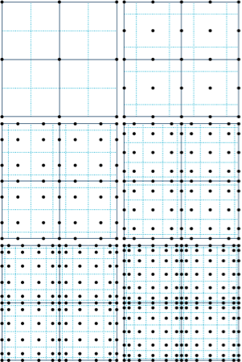
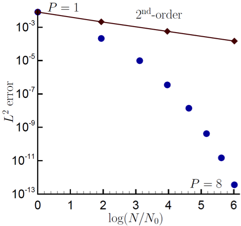

Discretization Approach
-----------------------

Nalu supports two discretizations: control volume finite element and
(CVFEM) edge-based vertex centered (EBVC). Each are finite volume
forumations and each solve for the primitives are are each considered
vertex-based schemes. Considerable testing has provided a set of general
rules as to which scheme is optimal. In general, all equations and
boundary conditions support either equation discretization with
exception of the solid stress equation which has only been implemented
for the CVFEM technique.

For generalized unstructured meshes that have poor quality, CVFEM has
been shown to excell in accuracy and robustness. This is mostly due to
the inhearant accuracy limitation for the non-orthogonal correction
terms that appear in the diffusion term and pressure stabilization for
the EBVC scheme. For generalized unstructured meshes of decent quality,
either scheme is ideal. Finally, for highly structured meshes with
substantail aspect ratios, the edge-based scheme is ideal.

In general, the edge-based scheme is at least two times faster per
iteration than the element-based scheme. For some classes of flows, it
can be up to four times faster. However, due to the lagged coupling
between the projected nodal gradient equation and the dofs, on meshes
with high non-orthogonality, nonlinear residual convergence can be
delayed.

CVFEM Dual Mesh
+++++++++++++++

The classic low Mach algorithm uses the finite volume technique known as
the control volume finite element method, see
Schneider, :cite:`Schneider:1987`, or
Domino, :cite:`Domino:2006`. Control volumes (the mesh dual)
are constructed about the nodes, shown in Figure :numref:`cvfemnodes` (upper left).
Each element contains a set of sub-faces that define control-volume
surfaces. The sub-faces consist of line segments (2D) or surfaces (3D).
The 2D segments are connected between the element centroid and the edge
centroids. The 3D surfaces (not shown here) are connected between the
element centroid, the element face centroids, and the edge centroids.
Integration points also exist within the sub-control volume centroids.

Recent work by Domino, :cite:`Domino:2014`, has provided a
proof-of-concept higher order CVFEM implementation whereby the linear
basis and dual mesh definition is extended to higher order. The current
code base supports the usage of P=2 elements (quadratic) for both 2D and
3D quad/hex topologies. This method has been formally demonstrated to be
third-order spatially accurate and second-order in-time accurate.
General polynomial promotion has been deployed in the higher order
github branch. Figure :numref:`cvfemnodes` illustrates a general polynomial
promotion from P=1 to P=6 and demonstrated spectral convergence
using the method of manufactured solutions in Figure :numref:`cvfemconv`.

.. _cvfemnodes:

   Polynomial promotion for a canonical CVFEM quad element patch from :math:`P=1` to :math:`P=6`.

.. _cvfemconv:

   A recent spectral convergence plot using the Method of Manufactured Solutions for :math:`P=1` through :math:`P=8`.

When using CVFEM, the discretized equations described in this manual are
evaluated at either subcontrol-surface integration points (terms that
have been integrated by parts) or at the subcontrol volume (time and
source terms). Interpolation within the element is obtained by the
standard elemental basis functions,

.. math::
   :label: cvfem-interpolation

   {\phi_{ip} = \sum N^{ip}_k \phi_k.}

where the index :math:`k` represents a loop over all nodes in the
element.

Gradients at the subcontrol volume surfaces are obtained by taking the
derivative of Eq. :eq:`cvfem-interpolation`, to obtain,

.. math::
   :label: cvfem-derivative

   \frac{\partial \phi_{ip}}{\partial x_j} = \sum \frac{\partial N^{ip}_{j,k}} {\partial x_j} \phi_k.

The usage of the CVFEM methods results in the canonical 27-point stencil
for a structured hexahedral mesh.

Edge-Based Discretization
+++++++++++++++++++++++++

In the edge-based discretization, the dual mesh defined in the CVFEM
method is used to pre-process both dual mesh nodal volumes (needed in
source and time terms) and edge-based area vectors (required for
integrated-by-parts quantities, e.g., advection and diffusion terms).

.. _cvfem-onecv:

   
   A control volume centered about a finite-element node in a collection of 2-D quadrilateral elements (from :cite:`Domino:2006`.)

Consider Figure :numref:`cvfem-onecv`, which is the original set of CVFEM dual mesh
quadrature points shown above in Figure :numref:`cvfemnodes`. Specifically, there are four subcontrol
volumes about node 5 that contribute to the nodal volume dual mesh. In
an edge-based scheme, the time and source terms use single point
quadrature by assembling these four subcontrol volume contributions
(eight in 3D) into one single nodal volume. In most cases, source terms
may include gradients that are obtained by using the larger
element-based stencil.

The same reduction of gauss points is realized for the area vector.
Consider the edge between nodes 5 and 6. In the full CVFEM approach,
subcontrol surfaces within the top element (5,6,9,8) and bottom element
(2,3,6,5) are reduced to a single area vector at the edge midpoint of
nodes 5 and 6. Therefore, advection and diffusion is now done in a
manner very consistent with a cell centered scheme, i.e., classic
“left”/“right” states. 

The consolidation of time and source terms to nodal locations along with
advection and diffusion at the edge mid-point results in a canonical
five-point stencil in 2D and seven in 3D. Note the ability to handle
hybrid meshes is readily peformed one nodal volume and edge area are
pre-processed. Edges and nodes are the sole topology that are iterated,
thus making this scheme highly efficient, although inherantly limited to
second order spatial order of accuracy.

In general, the edge-based scheme is second order spatially accurate.
Formal verification has been done to evaluate the accuracy of the EBVC
relative to other implemented methods
(Domino, :cite:`Domino:2014`). The edge-based scheme, which
is based on dual mesh post-processing, represents a commonly used finite
volume method in gas dynamics applications. The method also lends itself
to psuedo-higher order methodologies by the blending of extrapolated
values using the projected nodal gradient and gauss point values (as
does CVFEM). This provides a fourth order accurate diffusion and
advection operator on a structured mesh.

The use of a consistent mass matrix is less apparent in edge-based
schemes. However, if desired, the full element-based stencil can be used
by iterating elements and assembling to the nodes.

The advantage of edge-based schemes over cell centered schemes is that
the scheme naturally allows for a mixed elemental discretization.
Projected nodal gradients can be element- or edge-based. LES filters and
nodal gradients can also exploit the inherant elemental basis that
exists in the pure CVFEM approach. In our experience, the optimal scheme
on high quality meshes uses the CVFEM for the continuity solve and EBVC
discretization for all other equations. This combination allows for the
full CVFEM diffusion operator for the pressure Poisson equation and the
EBVC approach for equations where inverse Reynolds scaling reduces the
importance of the diffusion operator. This scheme can be activated by
the use of the ``use_edges: yes`` Realm line
command in combination of the LowMachEOM system line command,
``element_continuity_eqs: yes``.

Projected Nodal Gradients
+++++++++++++++++++++++++

In the edge or element-based algorithm, projected nodal gradients are
commonplace. Projected nodal gradients are used in the fourth order
pressure stabilization terms, higher order upwind methods, discontinuity
capturing operators (DCO) and turbulence source terms. For an edge-based
scheme, they are also used in the diffusion term when non-orthogonality
of the mesh is noted.

There are many procedures for determining the projected nodal gradient
ranging from element-based schemes to edge-based approached. In general,
the projected nodal gradient is viewed as an :math:`L_2` minimization
between the discontinuous Gauss-point value and the continuous nodal
value. The projected nodal gradient, in an :math:`L_2` sence is given
by,

.. math::
   :label: png1

   \int w G_j \phi {dV} = \int \frac{\partial \phi}{\partial x_j}{dV}.

Using integration-by-parts and a piece-wise constant test function, the
above equation is written as,

.. math::
   :label: png2

   \int w_I G_j \phi {dV} = \int \phi_{ip} n_j {dS}.

For a lumped L2 projected nodal gradient, the approach is based on a
Green-Gauss integration,

.. math::
   :label: green-gauss

   G_j \phi = \frac{\int \phi_{ip} A_j}{dV}.

In the above lumped mass matrix approach, the value at the integration
point can either be based on the CVFEM dual mesh evaluated at the
subcontrol surface, i.e., the line command option, ``element`` or
the ``edge``, which evaluates the term at the edge midpoint using
the assemble edge area vector. In all cases, the lumped mass matrix
approach is strickly second order accurate. When running higher order
CVFEM, a consistent mass matrix appraoch is required to maintain design
order of the overall discretization. This is strickly due to the
pressure stabilization whose accuracy can be affected by the form of the
projected nodal gradient (see the Nalu theory manual or a variety of
SNL-based publications).

In the description that follows, :math:`\bar{G_j \phi}` represent the
average nodal gradient evaluated at the integration point of interest.

The choice of projected nodal gradients is specified in the input file
for each dof. Keywords ``element`` or ``edge`` are used
to define the form of the projection. The forms of the projected nodal
gradients is arbitrary relative to the choosed underlying
discretization. For strongly non-orthogonal meshes, it is recommended to
use an element-based projected nodal gradient for the continuity
equation when the EBVC method is in use. In some limited cases, e.g.,
pressure, mixture fraction and enthalpy, the ``manage-png`` line
command can be used to solve the simple linear system for the consistent
mass matrix.

Time and Source Terms
+++++++++++++++++++++

Time and source terms also volumetric contributions and also use the
dual nodal volume. In both discretization approaches, this assembly is
achieved as a simple nodal loop. In some cases, e.g., the :math:`k_{sgs}` partial
differential equation, the source term can use projected nodal
gradients.

.. math:: \int \frac{\partial \rho \phi }{\partial t} dV = \int S_{\phi}dV

Diffusion
+++++++++

As already noted, for the CVFEM method, the diffusion term at the
subcontrol surface integration points use the the elemental shape
functions and derivatives. For the standard diffusion term, and using
Eq. :eq:`cvfem-derivative`, the CVFEM diffusion operator contribution at a
given integration point (here simply demonstrated for a 2D edge with
prescribed area vector) is as follows,

.. math::

     -\int \Gamma \frac{\partial \phi}{\partial x_j} A_j =
     - \Gamma_{ip} \left[ \left(\frac{\partial N^{ip}_0}
     {\partial x} \phi_0 + \frac{\partial N^{ip}_1} {\partial x}
     \phi_1 \right) A_x + \left(\frac{\partial N^{ip}_0} {\partial y}
     \phi_0 + \frac{\partial N^{ip}_1} {\partial y} \phi_1 \right) A_y \right]

Standard Gauss point locations at the subcontrol surfaces can be shifted
to the edge-midpoints for a more stable (monotonic) diffusion operator
that is better conditioned for high aspect ratio meshes.

For the edge-based diffusion operator, special care is noted as there is
no ability to use the elemental basis to define the diffusion operator.
As with cell-centered schemes, non-orthogonal contributions for the
diffusion operator arise due to a difference in direction between the
assembled edge area vector and the distance vector between nodes on an
edge. On skewed meshes, this non-orthogonality can not be ignored.

Following the work of Jasek, :cite:`Jasek:1996`, the
over-relaxed approach is used. The form of any gradient for direction
:math:`j` for field :math:`\phi` is

.. math::
   :label: generalGrad

   \frac{\partial \phi}{\partial x_j}_{ip} = \bar{G_j\phi}
   + \left[ \left(\phi_R - \phi_L \right) 
   - \bar{G_l\phi}dx_l \right] \frac{A_j}{A_k dx_k}.

In the above expression, we are iterating edges with a Left node
:math:`L` and Right node :math:`R` along with edge-area vector,
:math:`A_j`. The :math:`\bar{G_j \phi}` is simple averaging of the left
and right nodes to the edge midpoint. In general, a standard edge-based
diffusion term is written as,

.. math::

     -\int \Gamma \frac{\partial \phi}{\partial x_j} A_j &=
     - \Gamma_{ip} \left[ \left(\bar{G_x \phi}A_x + \bar{G_y \phi}A_y \right)
     + \left( \phi_R - \phi_L \right) \frac{A_x A_x + A_y A_y}{A_x dx_x + A_y dx_y} \right. \\ 
     &- \left. \left( \bar{G_x \phi}dx_x + \bar{G_y \phi}dx_y \right)
     \frac{A_x A_x + A_y A_y} {A_x dx_x + A_y dx_y} \right].

Momentum Stress
~~~~~~~~~~~~~~~

The viscous stress tensor, :math:`\tau_{ij}` is formed based on the
standard gradients defined above for either the edge or element-based
discretization. The viscous force for component :math:`i` is given by,

.. math::

   -\int \tau_{ij} A_j = -\int \mu_{ip}\left( \frac{\partial u_i}{\partial x_j}
   + \frac{\partial u_j}{\partial x_i} \right) A_j.

For example, the x and y-component of viscous force is
given by,

.. math::

   F_x &= - \mu_{ip} \left( \frac{\partial u_x}{ \partial x}A_x + \frac{\partial u_x}{\partial y}A_y \right ) 
   - \mu_{ip} \left( \frac{\partial u_x}{ \partial x}A_x + \frac{\partial u_y}{ \partial x}A_y \right), \\
   F_y &= - \mu_{ip} \left( \frac{\partial u_y}{ \partial x}A_x + \frac{\partial u_y}{\partial y}A_y \right ) 
   - \mu_{ip} \left( \frac{\partial u_x}{ \partial y}A_x + \frac{\partial u_y}{ \partial y}A_y \right).

Note that the first part of the viscous stress is simply the standard
diffusion term. Note that the so-called non-solonoidal viscous stress
contribution is frequently written in terms of projected nodal
gradients. However, for CVFEM this procedure is rarely used given the
elemental basis definition. As such, the use of shape function
derivatives is clear.

The viscous stress contribution at an integration point for CVFEM (again
using the 2D example with variable area vector) can be written as,

.. math::

     F_x &= - \Gamma_{ip} \left[ \left(\frac{\partial N^{ip}_0}
     {\partial x} {u_x}_0 + \frac{\partial N^{ip}_1} {\partial x} {u_x}_1 \right) A_x
     + \left(\frac{\partial N^{ip}_0} {\partial y} {u_x}_0 + \frac{\partial N^{ip}_1}
     {\partial y} {u_x}_1 \right) A_y \right. \\ 
     &+ \left. \left(\frac{\partial N^{ip}_0} {\partial x} {u_x}_0
     + \frac{\partial N^{ip}_1} {\partial x} {u_x}_1 \right) A_x
     + \left(\frac{\partial N^{ip}_0} {\partial y} {u_y}_0 + \frac{\partial N^{ip}_1}
     {\partial x} {u_y}_1 \right) A_y \right], \\ 
     F_y &= - \Gamma_{ip} \left[ \left(\frac{\partial N^{ip}_0} {\partial x}
     {u_y}_0 + \frac{\partial N^{ip}_1} {\partial x} {u_y}_1 \right) A_x
     + \left(\frac{\partial N^{ip}_0} {\partial y} {u_y}_0 + \frac{\partial N^{ip}_1}
     {\partial y} {u_y}_1 \right) A_y \right. \\ 
     &+ \left. \left(\frac{\partial N^{ip}_0} {\partial y} {u_x}_0
     + \frac{\partial N^{ip}_1} {\partial y} {u_x}_1 \right) A_x
     + \left(\frac{\partial N^{ip}_0} {\partial y} {u_y}_0 + \frac{\partial N^{ip}_1}
     {\partial x} {u_y}_1 \right) A_y \right].

For the edge-based diffusion operator, the value of :math:`\phi` is
substituted for the component of velocity, :math:`u_i` in the
Eq. :eq:`generalGrad`.

.. math::

   \frac{\partial u_i}{\partial x_j}_{ip} = \bar{G_j u_i}
   + \left[ \left({u_i}_R - {u_i}_L \right) 
   - \bar{G_l u_i}dx_l \right] \frac{A_j}{A_k dx_k}.

Common approaches in the cell-centered community are to use
the projected nodal gradients for the
:math:`\frac{\partial u_j}{\partial x_i}` stress component. However, in
Nalu, the above form of equation is used.

Substituting the relations of the velocity gradients for the x and
y-componnet of force above provides the following expression used for
the viscous stress contribution:

.. math::

     F_x &= - \mu_{ip} \left[ \left(\bar{G_x u_x}A_x + \bar{G_y u_x}A_y \right)
     + \left( {u_x}_R - {u_x}_L \right) \frac{A_x A_x + A_y A_y}{A_x dx + A_y dy} \right.  \\ 
     &- \left. \left( \bar{G_x u_x}dx + \bar{G_y u_x}dy \right) \frac{A_x A_x + A_y A_y} {A_x dx + A_y dy} \right]  \\ 
     &- \mu_{ip} \left[ \bar{G_x u_x}A_x + \bar{G_x u_y}A_y
     + \left({u_x}_R - {u_x}_L\right) \frac{A_x A_x} {A_x dx + A_y dy} \right. \\
     &+ \left. \left({u_y}_R - {u_y}_L\right) \frac{A_x A_y} {A_x dx + A_y dy} \right. \\ 
     &- \left. \left( \bar{G_x u_x}dx + \bar{G_y u_x}dy \right) \frac{A_x A_x} {A_x dx + A_y dy} \right. \\ 
     &- \left. \left( \bar{G_x u_y}dx + \bar{G_y u_y}dy \right) \frac{A_x A_y} {A_x dx + A_y dy} \right],

.. math::

     F_y &= - \mu_{ip} \left[ \left(\bar{G_x u_y}A_x + \bar{G_y u_y}A_y \right)
     + \left( {u_y}_R - {u_y}_L \right) \frac{A_x A_x + A_y A_y}{A_x dx + A_y dy} \right. \\ 
     &- \left. \left( \bar{G_x u_y}dx + \bar{G_y u_y}dy \right) \frac{A_x A_x + A_y A_y} {A_x dx + A_y dy} \right]  \\
     &- \mu_{ip} \left[ \bar{G_y u_x}A_x + \bar{G_y u_y}A_y
     + \left({u_y}_R - {u_y}_L\right) \frac{A_y A_y} {A_x dx + A_y dy} \right. \\
     &+ \left. \left({u_x}_R - {u_x}_L\right) \frac{A_y A_x} {A_x dx + A_y dy} \right.  \\ 
     &- \left. \left( \bar{G_x u_y]}dx + \bar{G_y u_y}dy \right) \frac{A_y A_y} {A_x dx + A_y dy} \right. \\ 
     &- \left. \left( \bar{G_x u_x}dx + \bar{G_y u_x}dy \right) \frac{A_y A_x} {A_x dx + A_y dy} \right],

where above, the first :math:`[]` and second :math:`[]` represent the
:math:`\frac{\partial u_i}{\partial x_j}A_j` and
:math:`\frac{\partial u_j}{\partial x_i}A_j` contributions,
respectively.

One can use this expression to recognize the ideal LHS sensitivities for
row and columns for component :math:`u_i`.

