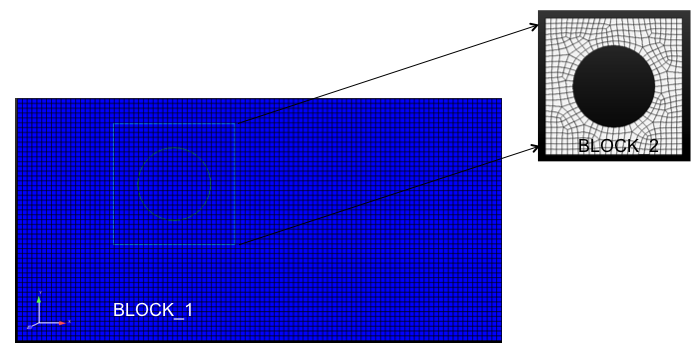
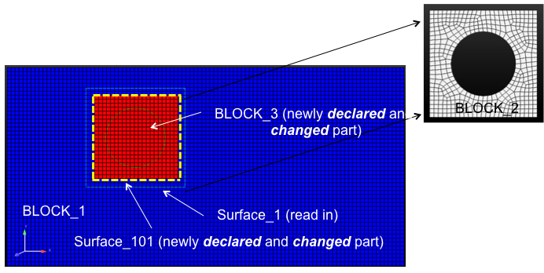
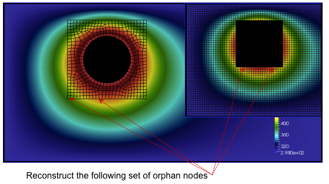
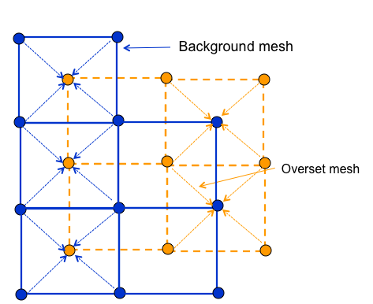
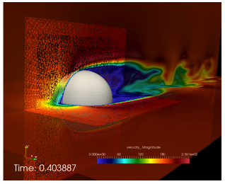
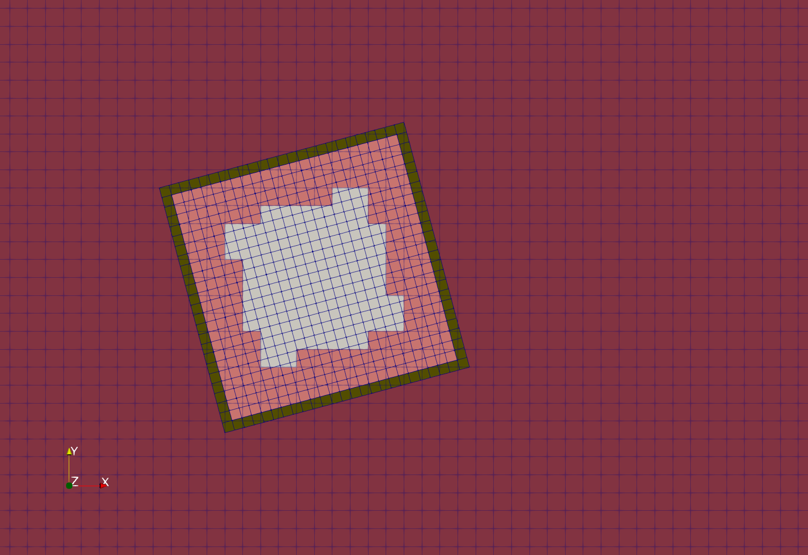
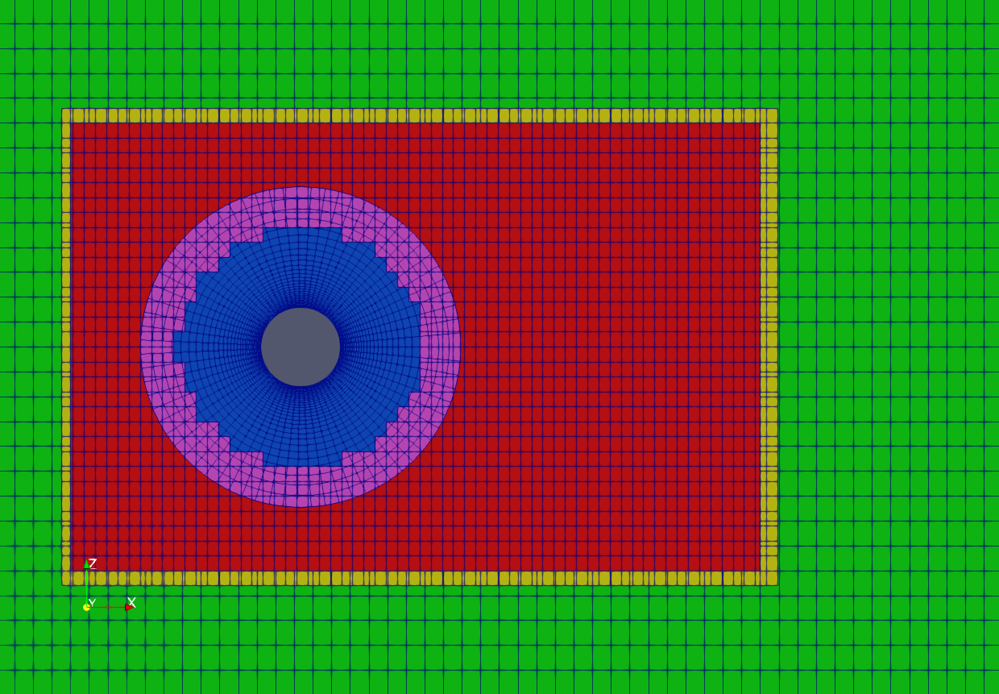
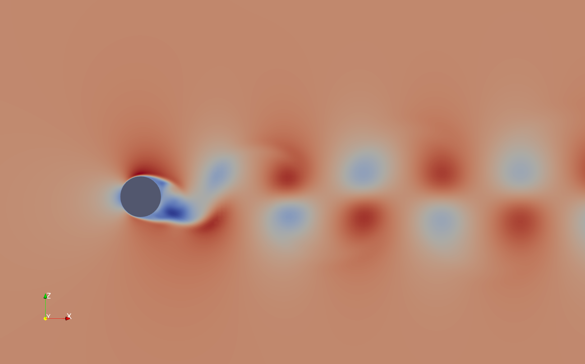
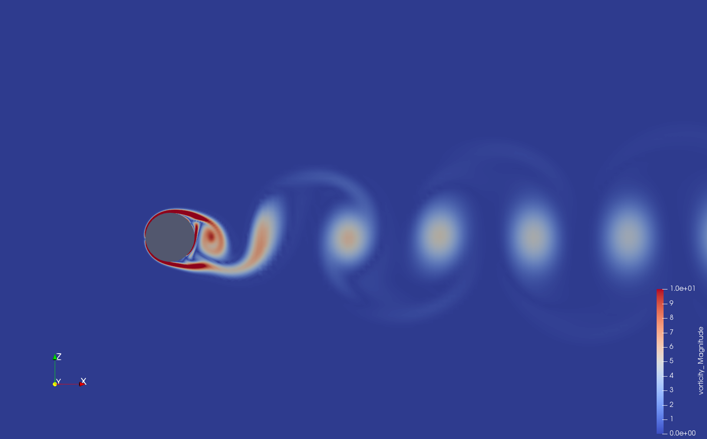

Overset
-------

Nalu supports simulations using an overset mesh methodology to model complex
geometries. Currently the codebase supports two approaches to determine overset
mesh connectivity:

  #. Overset mesh hole-cutting algorithm based on native STK search routines, and

  #. Hole-cutting and donor/reception determination using the `TIOGA
     <https://github.com/jsitaraman/tioga>`_ (Topology Independent Overset Grid
     Assembly) TPL.

The native STK based overset grid assembly (OGA) requires no additional
packages, but is limited to simple geometries where the search and hole-cutting
procedure works only simple rectangular boundaries (for the inner mesh) that are
aligned along the major axes. On the other hand, TIOGA based hole cutting is
capable of performing overset grid assembly on arbitrary mesh geometries and
orientation, supports generalized mesh motion, and can determine donor/recipient
status with multiple meshes overlapping in the same space. A specific use-case
for the need to perform OGA on multiple meshes is the simulation of a wind
turbine in an atmospheric boundary layer, where the turbine blade, nacelle, and
the background ABL mesh might all overlap near the rotor hub.

Overset Grid Assembly using Native STK Search
~~~~~~~~~~~~~~~~~~~~~~~~~~~~~~~~~~~~~~~~~~~~~

The overset descriptions begins with the basic background mesh (block 1)
and overset mesh (block 2) depicted in Figure :numref:`overset-block-one-two`. Also
shown in this figure is the reduction outer surface of block 2 (light
blue). Elements within this reduced overset block will be determined by
a parallel search. The collection of elements within this bounding box
will be skinned to form a surface on which orphan nodes are placed.
Elements within this volume are set in a new internally managed inactive
block. These mesh entities are fully removed from the overall matrix for
each dof. Elements within this volume are provided a masking integer
element varibale of unity to select out of the visualizattion tool.
Therefore, orphan nodes live at the external boundary of block 2 and
along the reduced surface. The parallel search provides the mapping of
orphan node and owning element from which the state can be
constructed.

.. _overset-block-one-two:

   Two-block use case describing background mesh (block 1) and overset
   mesh (block 2).

After the full search and overset initialization, this simple example
yields the original block 1 and 2, the newly created inactive block 3,
the original surface of the overset mesh and the new skinned surface
(101) of the inactive block (Figure :numref:`overset-block-one-two-cut`).

.. _overset-block-one-two-cut:

   Three-block and two surface, post over set initialization.

A simple heat conduction example is provided in Figure :numref:`overset-hc` where
the circular boundary is set at a temperature of 500 with all external
boundaries set to adiabatic.

.. _overset-hc:

   A simple heat conduction example providing the overset mesh and donor
   orphan nodes.

As noted before, every orphan node lies within an owning element.
Sufficient overlap is required to make the system well posed. A fully
implicit procedure is provided by writing the orphan node value as a
linear constraint of the owning element (Figure :numref:`overset-nodes`).

.. _overset-nodes:

   Orphan nodes for background and overset mesh for which a fully
   implicit constraint equation is written.

For completeness, the constraint equation for any dof :math:`\phi^o` is
simply,

.. math::
   :label: constraint

   \phi^o - \sum N_k \phi_k = 0.

As noted, full sensitivities are provided in the linear system by
constructing a row entry with the columns of the nodes within the owning
element and the orphan node itself.

Finally, a mixed hex/tet mesh configuration example (overset mesh is tet
while background is hex) is provided in Figure :numref:`overset-sphere`.

.. _overset-sphere:

   Flow past a three-dimensional sphere using a hybrid topology
   (hex/tet) mesh configuration.

Overset Grid Assembly using TIOGA
~~~~~~~~~~~~~~~~~~~~~~~~~~~~~~~~~

Topology Independent Overset Grid Assembler (TIOGA) is an open-source
connectivity package that was developed as an academic/research counterpart for
PUNDIT (the overset grid assembler used in NASA/Army CREATE A/V program and
HELIOS). The base library has been modified to remove the limitation where each
MPI rank could only own one mesh block. The code has been extended to handle
multiple mesh blocks per MPI rank to support Nalu's mesh decomposition
strategies.

TIOGA uses a different nomenclature for overset mesh assembly. A brief
description is provided here to familiarize users with the differences in
nomenclature used in the previous section. When determining overset
connectivity, TIOGA ends up assigning ``IBLANK`` values to the nodes in a mesh.
The ``IBLANK`` field is an integer field that determines the status of the node
which can be one of three states:

**field point**

  A field point is a node that behaves as a normal mesh point, i.e., the
  equations are solved on these nodes and the linear system assembly proceeds as
  normal. The *field points* are indicated by an ``IBLANK`` value of 1.

**fringe point**

  A fringe point is a receptor on the receving mesh where the solution field is
  mapped from the donor element. A fringe point is indicated by an ``IBLANK``
  value of ``-1``. Fringe points are how information is transferred between the
  participating meshes. Note that fringe points are referred to as *orphan
  points* in the STK based overset description.

**hole point**

  A hole point is a node on a mesh that occurs inside a solid body being modeled
  in another mesh. These points have no valid solution for the equations solved
  and should not participate in the linear system.

In addition to the ``IBLANK`` status, the following terms are useful when using
TIOGA

**donor element**

  The element that is used to *interpolate* field data from donor mesh to a
  recipient mesh. While TIOGA provides flow interpolation routines, the current
  implementation in Nalu uses the ``MasterElement`` classes in Nalu to maintain
  consistency between the STK and the TIOGA overset implementations.

**orphan points**

  The term orphan point is used differently in TIOGA than the STK based overset
  implementation. TIOGA refers to nodes as orphan points when there it cannot
  find a suitable donor element for those nodes that are considered fringe
  points. This can happen when the nodes on the enclosing element are themselves
  labeled fringe points.

Unlike the STK based hole cutting approach, that uses predefined bounding boxes
to determine donor/receptor locations, TIOGA uses the element volume as the
metric to determine the field and fringe points. The high level hole cutting
algorithm can be described in the following steps:

  - Determine and tag hole points that are fully enclosed within solid bodies,
    tag neighboring points to be fringe points.

  - Determine and flag all mandatory fringe points, e.g., embedded boundaries of
    interior meshes.

  - Determine fringe locations for the exterior meshes where information is
    transferred back from interior meshes to the exterior/background mesh.

In the current integration, only the hole-cutting and donor/receptor
information is processed by the TIOGA library. The linear system assembly,
specifically the constraint equations for the fringe points are managed by the
same classes that are used with the native STK hole-cutting approach.

Figure :numref:`tioga-rotated-box` shows the field and fringe points as
determined by TIOGA during the hole-cutting process. The central white region
shows the mesh points of the interior mesh. The salmon colored region shows the
overlapping field points where the flow equations are solved on both
participating meshes. The green-ish boundary shows the mandatory fringe points
for the interior mesh along its outer boundary. The interior boundary of the
overlap region are the fringe points for the background mesh where information
is transferred from the interior mesh. The extent of the overlap region is
determined by the number of element layers necessary to ensure adequate
separation between the fringe boundaries on the participating meshes.

.. _tioga-rotated-box:

   TIOGA overset hole cutting for a rotated internal mesh configuration showing
   the field and fringe locations.

Figure :numref:`tioga-overset-cyl` shows the resulting overset assembly for
cylinder mesh and a background mesh with an intermediate refinement zone. The
hole points (inside the cylinder) have been removed from the linear system for
both the intermediate and background mesh. The magenta region shows the overlap
of field points of the cylinder and the intermediate mesh. And the yellow region
shows the overlap between the background and the intermediate mesh.

.. _tioga-cyl-nested:

   Overset mesh configuration for simulating flow past a cylinder using a three
   mesh setup: near-body, body-fitted cylinder mesh, intermediate refined mesh,
   and coarse background mesh.

Figures :numref:`tioga-cyl-velocity` and :numref:`tioga-cyl-vorticity` shown the
velocity and vorticity contours for the flow past a cylinder simulated using the
overset mesh methodology with TIOGA overset connectivity.

.. _tioga-cyl-velocity:

   Velocity field for a flow past cylinder simulating using an overset mesh
   methodology with TIOGA mesh connectivity approach.

.. _tioga-cyl-vorticity:

   Vorticity field for a flow past cylinder simulating using an overset mesh
   methodology with TIOGA mesh connectivity approach.
