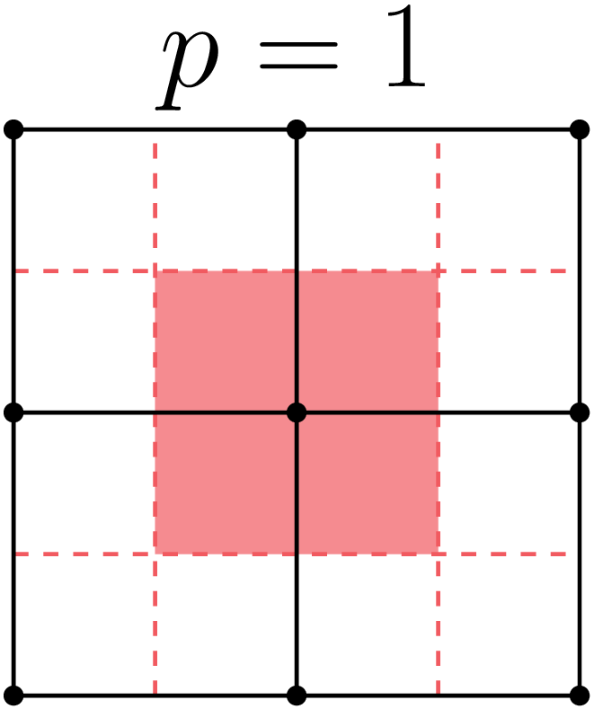

Wind Energy Modeling
====================

Wind energy analysis is the primary application area for the Nalu development
team. This section describes the theoretical basis of Nalu from a wind energy
perspective, using nomenclature familiar to wind energy experts and mapping it
to Nalu concepts and nomenclature described in previous sections. Hopefully,
this will provide an easier transition for users familiar with WRF and SOWFA to
Nalu.

In order to evaluate the energy output and the structural loading on wind
turbines, the code must model: 1. the incoming turbulent wind field across the
entire wind farm, and 2. the evolution of turbine wakes in turbulent inflow
conditions and their interaction with the downstream turbines. First, the
governing equations with all the terms necessary to model a wind farm are
presented with links to implementation and verification details elsewhere in the
theory and/or verification manuals. A brief description of Nalu's numerical
discretization schemes is presented next. This is followed by a brief discussion
of the boundary conditions used to model atmospheric boundary layer (ABL) flows
with or without wind turbines (currently modeled as actuator sources within the
flow domain).

Currently Nalu supports two types of wind simulations:

**Precursor simulations**

  Precursor simulations are used in wind applications to generate time histories
  of turbulent ABL inflow profiles that are used as inlet conditions in
  subsequent wind farm simulations. The primary purpose of these simulations are
  to trigger turbulence generation and obtain velocity and temperature profiles
  that have *converged* to a stastitic equilibrium.

**Wind farm simulation with turbines as actuator sources**

  In this case, the wind turbine blades and tower are modeled as actuator source
  terms by coupling to the `OpenFAST
  <https://openfast.readthedocs.io/en/master/>`_ libraries. Velocity fields are
  sampled at the blade and tower control points within the Nalu domain and the
  blade positions and blade/tower loading is provided by OpenFAST to be used as
  source terms within the momentum equation.

Governing Equations
-------------------

We begin with a review of the momentum and enthalpy conservation equations
within the context of wind farm modeling :cite:`Churchfield:2012`. Equation
:eq:`ablmom` shows the Favre-filtered momentum conservation equation (Eq.
:eq:`favmom`) reproduced here with all the terms required to model a wind farm.

.. math::
   :label: ablmom

   \underbrace{\frac{\partial}{\partial t} \left(\bar{\rho}\, \widetilde{u}_i\right)}_\mathbf{I} +
   \underbrace{\frac{\partial}{\partial x_j} \left( \bar{\rho}\, \widetilde{u}_i \widetilde{u}_j \right)}_\mathbf{II} =
     - \underbrace{\frac{\partial p'}{\partial x_j} \delta_{ij}}_\mathbf{III}
     - \underbrace{\frac{\partial \tau_{ij}}{\partial x_j}}_\mathbf{IV}
     - \underbrace{2\bar{\rho}\,\epsilon_{ijk}\,\Omega_ju_k}_\mathbf{V}
     + \underbrace{\left(\bar{\rho} - \rho_\circ \right) g_i}_\mathbf{VI}
     + \underbrace{S^{u}_{i}}_\mathbf{VII} + \underbrace{f^{T}_i}_\mathbf{VIII}

Term :math:`\mathbf{I}` represents the time rate of change of momentum (inertia);

Term :math:`\mathbf{II}` represents advection;

Term :math:`\mathbf{III}` represents the pressure gradient forces (deviation from
hydrostatic and horizontal mean gradient);

Term :math:`\mathbf{IV}` represents stresses (both viscous and sub-filter scale
(SFS)/Reynolds stresses);

Term :math:`\mathbf{V}` describes the influence Coriolis forces due to earth's rotation -- see  Sec. :numref:`earth_coriolis_force`;

Term :math:`\mathbf{VI}` describes the effects of buoyancy using the Boussinesq approximation -- see :numref:`boussinesq_buoyancy_model`;

Term :math:`\mathbf{VII}` represents the source term used to drive the flow to a
horizontal mean velocity at desired height(s) -- see :numref:`abl_forcing_term`; and

Term :math:`\mathbf{VIII}` is an optional term representing body forces when
modeling turbine with actuator disk or line representations -- see
:numref:`act_wind_turbine_aerodynamics`.

In wind energy applications, the energy conservation equation is often written
in terms of the Favre-filtered potential temperature, :math:`\theta`, equation,
as shown below

.. math::
   :label: abl_pottemp

   \frac{\partial}{\partial t} \left(\bar{\rho}\, \widetilde{\theta}\right) +
   \frac{\partial}{\partial t} \left(\bar{\rho}\, \widetilde{u}_j \widetilde{\theta} \right) = - \frac{\partial}{\partial x_j} \hat{q}_j

where, :math:`\hat{q}_j` represents the temperature transport due to molecular and SFS
turbulence effects. Due to the high Reynolds number associated with ABL flows,
the molecular effects are neglected everywhere except near the terrain.
Potential temperature is related to absolute temperature by the following
equation

.. math::

   \theta = T \left ( \frac{\bar{p}}{p_\circ} \right)^{-\left(\frac{R}{c_p}\right)}

Under the assumption of ideal gas conditions and constant :math:`c_p`, the gradients in
potential temperature are proportional to the gradients in absolute temperature,
i.e.,

.. math::

   \left[ \frac{\partial T}{\partial t}, \frac{\partial T}{\partial x}, \frac{\partial T}{\partial y} \right] =
   \left( \frac{\bar{p}}{p_\circ} \right)^\left(\frac{R}{c_p}\right) \left[ \frac{\partial \theta}{\partial t}, \frac{\partial \theta}{\partial x}, \frac{\partial \theta}{\partial y} \right]

Furthermore, ignoring the pressure and viscous work terms in Eq. :eq:`fav-enth`
and assuming constant density (incompressible flow), it can be shown that
solving the enthalpy equation is equivalent to solving the potential temperature
equation. The enthalpy equation solved in wind energy problems is shown below

.. math::
   :label: abl_enth

   \frac{\partial}{\partial t} \left(\bar{\rho}\, \widetilde{T}\right) +
   \frac{\partial}{\partial t} \left(\bar{\rho}\, \widetilde{u}_j \widetilde{T} \right) = - \frac{\partial}{\partial x_j} q_j

It is noted here that the terms :math:`\hat{q}_j` (Eq. :eq:`abl_pottemp`) and
:math:`q_j` (Eq. :eq:`abl_enth`) are not equivalent and must be scaled
appropriately. User can still provide the appropriate initial and boundary
conditions in terms of potential temperature field. Under these assumptions and
conditions, the resulting solution can then be interpreted as the variation of
potential temperature field in the computational domain.

Turbulence Modeling
-------------------

LES turbulence closure is provided by the :ref:`theory_ksgs_les_model` or the
standard :ref:`Smagorinsky <theory_standard_smagorinsky_les>` model for wind
farm applications.

Numerical Discretization & Stabilization
----------------------------------------

Nalu provides two dicretization approaches

**Control Volume Finite Element Method (CVFEM)**

  Nalu uses a *dual mesh* approach (see :numref:`theory_cvfem_dual_mesh`) where
  the *control volumes* are constructed around the nodes of the finite elements
  within the mesh -- see :numref:`windenergy_cvfem_fig`. The equations are
  solved at the *integration* points on the *sub-control surfaces* and/or the
  *sub-control volumes*.

**Edge-Based Vertex Centered Scheme**

  The edge-based scheme is similar to the finite-volume approach used in SOWFA
  with the nodes at the *cell center* of the dual mesh.

.. _windenergy_cvfem_fig:

   Schematic of HEX-8 mesh showing the finite elements, nodes, and the
   associated control volume dual mesh.

The numerical discretization approach is covered in great detail in
:numref:`theory_discretization_approach`, the advection and pressure
stabilization approaches are documented in
:numref:`theory_advection_stabilization` and
:numref:`theory_pressure_stabilization` respectively. Users are strongly urged
to read those sections to gain a thorough understanding of the discretization
scheme and its impact on the simulations.

Time stepping scheme
--------------------

The time stepping method in Nalu is described in the Fuego theory manual
:cite:`FuegoTheoryManual:2016` for the backward Euler time discretization. The
implementation details of the BDF2 time stepping scheme used in Nalu is
described here. The Navier-Stokes equations are written as 

.. math::
   :label: fav-mom-nalu
           
   {\bf F}_i (\rho^{n+1}, u_i^{n+1}, P^{n+1}) - \int \left . \frac{\partial \rho u_i}{\partial t} \right |^{n+1} {\rm d}V &= 0, \\
   {\bf F}_i (\rho^{n+1}, u_i^{n+1}, P^{n+1}) - \frac{ (\gamma_1 \rho^{n+1} {u_i}^{n+1} + \gamma_2 \rho^n {u_i}^{n} + \gamma_3 \rho^n {u_i}^{n-1})}{\Delta t} \Delta V &=0,

where

.. math::
           
   {\bf F}_i (\rho^{n+1} u_i^{n+1}) &= - \int \rho^{n+1} u_i^{n+1} u_j^{n+1} n_j {\rm d}S  + \int \tau_{ij}^{n+1} n_j {\rm d}S - \int P^{n+1} n_i {\rm d}S - \int \left(\rho^{n+1} - \rho_{\circ} \right) g_i {\rm d}V, \\
   &= - \int u_i^{n+1} \dot{m}^{n+1}  + \int \tau_{ij}^{n+1} n_j {\rm d}S  - \int P^{n+1} n_i {\rm d}S - \int \left(\rho^{n+1} - \rho_{\circ} \right) g_i {\rm d}V. \\
   
   
and :math:`\gamma_i` are factors for BDF2 time discretization scheme (see
:numref:`theory_time_discretization`). As is typical of incompressible flow
solvers, the mass flow rate through the sub-control surfaces is tracked
independent of the velocity to maintain conservation of mass. The following
conventions are used:

.. math::

   \phi^* &= \textrm{ Predicted value of } \phi \textrm{ at } n+1 \textrm{ time step before linear solve} \\
   \widehat{\phi} = \phi^{**} &= \textrm{ Predicted value of } \phi \textrm{ at } n+1 \textrm{ time step after linear solve}

The Newton's method is used along with a linearization procedure to predict a
solution to the Navier-Stokes equations at time step :math:`n+1` as

.. math::
   :label: fav-mom-nalu-newton
           
   \mathbf{A}_{ij} \; \delta u_{j} &= {\bf F}_i^{*} - \frac{ (\gamma_1 \rho^{*} {u_i}^{*} + \gamma_2 \rho^n {u_i}^{n} + \gamma_3 \rho^n {u_i}^{n-1})}{\Delta t} \Delta V, \\
   \textrm{where } \delta u_{j} &= u_i^{**} - u_i^*, \\
   \mathbf{A}_{ij} &= \left ( \frac{ \gamma_1 \rho^{*}}{\Delta t} \Delta V \delta_{ij} - \left . \frac{\partial F_i}{\partial u_j} \right |^{*} \right ), \\
   \textrm{and } {\bf F}_i^{*} &= - \int u_i^* \dot{m}^*  + \int \tau_{ij}^* n_j {\rm d}S  - \int P^* n_i {\rm d}S - \int \left(\rho^* - \rho_{\circ} \right) g_i {\rm d}V.

After each Newton or *outer* iteration, :math:`\phi^{**}` is a better approximation to :math:`\phi^{n+1}` compared to :math:`\phi^*`. :math:`\rho*` and :math:`\dot{m}^*` are retained constant through each outer iteration. :math:`{\bf F} (\rho^{*} u_i^{**})` is linear in :math:`u_i^*` and hence

.. math::
   :label: linearize-f-phi-star
           
   {\bf F}_i^* = \left . \frac{\partial F_i}{\partial u_j} \right |^{*} u_j^{*} - \int P^{*} n_i {\rm d}S - \int \left(\rho^{*} - \rho_{\circ} \right) g_i {\rm d}V 
   
Applying Eq. :eq:`linearize-f-phi-star` to Eq. :eq:`fav-mom-nalu-newton`, we get the
linearized momentum predictor equation solved in Nalu.

.. math::   
   :label: fav-mom-nalu-linearize-f
      
   {\bf A}_{ij} \; \delta u_j &= \left . \frac{\partial F_i}{\partial u_j} \right |^{*} u_j^{*} - \int P^{*} n_i {\rm d}S - \int \left(\rho^{*} - \rho_{\circ} \right) g_i {\rm d}V  \\
   & \quad \quad  - \frac{ (\gamma_1 \rho^{*} {u_i}^{*} + \gamma_2 \rho^{n} {u_i}^{n} + \gamma_3 \rho^{n-1} {u_i}^{n-1})}{\Delta t} \Delta V \\
   {\bf A}_{ij} \; \delta u_j &= \left (\frac{ \gamma_1 \rho^{*}}{\Delta t} \Delta V \delta_{ij} - \left . \frac{\partial F_i}{\partial u_j} \right |^{*} \right ) {u_j}^{*} - \int P^{*} n_i {\rm d}S - \int \left(\rho^{*} - \rho_{\circ} \right) g_i {\rm d}V \\
   & \quad - \frac{ (\gamma_2 \rho^{n} {u_i}^{n} + \gamma_3 \rho^{n-1} {u_i}^{n-1})}{\Delta t} \Delta V  \\
   {\bf A}_{ij} \; \delta u_j & = {\bf A}_{ij} \; u_j^{*} - \int P^{*} n_i {\rm d}S - \int \left(\rho^{*} - \rho_{\circ} \right) g_i {\rm d}V \\
   & \quad - \frac{ (\gamma_2 \rho^{n} {u_i}^{n} + \gamma_3 \rho^{n-1} {u_i}^{n-1})}{\Delta t} \Delta V

:math:`u_i^{**}` will not satisfy the continuity equation. A correction step is
performed at the end of each outer iteration to make :math:`u_i^{**}`
satisfy the continuity equation as 

.. math::

   u_i^{n+1} &= u_i^{**} - \frac{\tau_3}{\rho} {\bf G} \Delta P^{**} \\
   \textrm{where } \Delta P^{**} &= P^{**} - P^*

As described in :numref:`theory_errors_splitting_stabilization`, the continuity
equation to be satisfied along with the splitting and stabilization errors is

.. math::
   :label: eq-continuity
           
   {\bf D } \rho u^{**} = b + \left ({\bf L_1} - {\bf D} \tau_3 {\bf G} \right ) \Delta P^{**} + \left ({\bf L_2} - {\bf D} \tau_2 {\bf G} \right ) P^{*}

where :math:`b` contains any source terms when the velocity field is not
divergence free and the other terms are the errors due to pressure stabilization
as shown by Domino :cite:`Domino:2006`. The final pressure Poisson equation
solved to enforce continuity at each outer iteration is
   
.. math::
   :label: eq-pressure

   u^{n+1} &= u^{**} - \frac{\tau_3}{\rho} {\bf G} \Delta P^{**} \\
   b + \left ({\bf L_1} - {\bf D} \tau_3 {\bf G} \right ) \Delta P^{**} &+ \left ({\bf L_2} - {\bf D} \tau_2 {\bf G} \right ) P^{*} \\
   &= {\bf D}(\rho u^{n+1}) = {\bf D} ( \rho \widehat{u}) - {\bf D }( \tau_3 {\bf G} \Delta P^{**} ) \\
   b + {\bf L_1} \Delta P^{**} &= {\bf D} (\rho \widehat{u}) - \left ({\bf L_2} - {\bf D} \tau_2 {\bf G} \right ) P^{*} \\
   -{\bf L_1} \Delta P^{**} &= {\bf D} \rho \widehat{u} + {\bf D} \tau_2 {\bf G} P^{*} - {\bf L_2} P^{*} \\
   -{\bf L_1} \Delta P^{**} &= - {\bf D} \rho \widehat{u} - {\bf D} \tau_2 {\bf G} P^{*} + {\bf L_2} P^{*} + b
  
Thus, the final set of equations solved at each outer iteration is

.. math::

   {\bf A}_{ij} \; \delta u_j & = {\bf A}_{ij} \; u_j^{*} - \int P^{*} n_i {\rm d}S - \int \left(\rho^{*} - \rho_{\circ} \right) g_i {\rm d}V \\
   & \quad - \frac{ (\gamma_2 \rho^{n} {u_i}^{n} + \gamma_3 \rho^{n-1} {u_i}^{n-1})}{\Delta t} \Delta V \\
   -{\bf L_1} \Delta P^{**} &= - {\bf D} \rho \widehat{u} - {\bf D} \tau_2 {\bf G} P^{*} + {\bf L_2} P^{*} + b \\
   u_i^{n+1} &= u_i^{**} - \frac{\tau_3}{\rho} {\bf G} \Delta P^{**}

Initial & Boundary Conditions
-----------------------------

This section briefly describes the boundary conditions available in Nalu for
modeling wind farm problems. The terrain and top boundary conditions are
described first as they are common to precusor and wind farm simulations.

Initial conditions
~~~~~~~~~~~~~~~~~~

Nalu has the ability to initialize the internal flow fields to uniform
conditions for all pressure, velocity, temperature, and TKE (:math:`k`) in the
:inpfile:`input file <initial_conditions.constant>`. Nalu also provides a *user
function* to add perturbations to the velocity field to trigger turbulence
generation during precursor simulations. To specify more complex flow field
conditions, a temperature profile with a capping inversion for example, users
are referred to pre-processing utilities available in `NaluWindUtils
<http://naluwindutils.readthedocs.io/en/latest/>`_ library.

Terrain (Wall) boundary condition
~~~~~~~~~~~~~~~~~~~~~~~~~~~~~~~~~~

Users are referred to :numref:`abl_surface_conditions` for the treatment of the
terrain BC using roughness models. For enthalpy, users can provide a surface heat
flux for modeling stratified flows.

Top boundary condition
~~~~~~~~~~~~~~~~~~~~~~

For momentum, a :ref:`symmetry BC <theory_symmetry_bc>` is used when modeling
wind farm problems. For enthalpy equation, a normal temperature gradient can be
specified to drive the flow to a desired temperaure profile, e.g., capping
inversion temperature profile.

Inlet conditions
~~~~~~~~~~~~~~~~

Time histories of inflow velocity and temperaure profiles can be provided as
inputs (via I/O transfer) to drive the wind farm simulation with the desired
flow conditions. See :numref:`verification_abl_prescribed_inflow` for more
details on this capability. Driving a wind farm simulation using velocity and
temperature fields from a mesoscale (WRF) simulation would require an additional
pre-processing steps with the `wrftonalu
<http://naluwindutils.readthedocs.io/en/latest/user/wrftonalu.html>`_ utility.

Outlet conditions
~~~~~~~~~~~~~~~~~

See the description of :ref:`open BC <theory_open_bc>` for detailed description
of the outlet BC implementation. For wind energy problems, it is necessary to
activate the global mass correction as a single value of pressure across the
boundary layer is not apprpriate in the presence of buoyancy effects. It might
also be necessary to fix the reference pressure at an interior node in order to
ensure that the Pressure Poisson solver is well conditioned.

.. _act_wind_turbine_aerodynamics:

Wind Turbine Modeling
---------------------

Wind turbine rotor and tower aerodynamic effects are modeled using actuator
source representations. Compared to resolving the geometry of the turbine,
actuator modeling alleviates the need for a complex body-fitted meshes, can
relax time step restrictions, and eliminates the need for turbulence modeling at
the turbine surfaces. This comes at the expense of a loss of fine-scale detail,
for example, the boundary layers of the wind turbine surfaces are not resolved.
However, actuator methods well represent wind turbine wakes in the mid to far
downstream regions where wake interactions are important.

Actuator methods usually fall within the classes of disks, lines, surface, or
some blend between the disk and line (i.e., the swept actuator line). Most
commonly, the force over the actuator is computed, and then applied as a
body-force source term, :math:`f_i` (Term :math:`\mathbf{VIII}`), to the
Favre-filtered momentum equation (Eq. :eq:`ablmom`).

The body-force term :math:`f_i` is volumetric and is a force per unit
volume. The actuator forces, :math:`F'_i`, are not volumetric. They exist along
lines or on surfaces and are force per unit length or area. Therefore, a
projection function, :math:`g`, is used to project the actuator forces into the
fluid volume as volumetric forces. A simple and commonly used projection
function is a uniform Gaussian as proposed by Sorensen and Shen
:cite:`Sorensen:2002`,

.. math:: g(\vec{r}) = \frac{1}{\pi^{3/2} \epsilon^3} e^{-\left( \left| \vec{r} \right|/\epsilon \right)^2},

where :math:`\vec{r}` is the position vector between the fluid point of
interest to a particular point on the actuator, and :math:`\epsilon` is
the width of the Gaussian, that determines how diluted the body force
become. As an example, for an actuator line extending from :math:`l=0`
to :math:`L`, the body force at point :math:`(x,y,z)` due to the line is
given by

.. math::
   :label: force-integral
           
   f_i(x,y,z) = \int_0^L g\left(\vec{r}\left(l\right)\right) F'_i\left(l\right) \: \textrm{d} l.
   

Here, the projection function’s position vector is a function of
position on the actuator line. The part of the line nearest to the point in
the fluid at :math:`(x,y,z)` has most weight.

The force along an actuator line or over an actuator disk is often
computed using blade element theory, where it is convenient to discretize
the actuator into a set of elements. For example, with the actuator line,
the line is broken into discrete line segments, and the force at the center
of each element, :math:`F_i^k`, is computed. Here, :math:`k` is the actuator
element index. These actuator points are independent of the fluid mesh.
The point forces are then projected onto the fluid mesh using the Gaussian
projection function, :math:`g(\vec{r})`, as described above.
This is convenient because the integral given in Equation
:eq:`force-integral` can become the summation

.. math::
   :label: force-summation
           
   f_i(x,y,z) = \sum_{k=0}^N g(\vec{r}^k) F_i^k.
   

This summation well approximates the integral given in Equation
:eq:`force-integral` so long as the ratio of actuator element size to
projection function width :math:`\epsilon` does not exceed a certain threshold.

Presently, Nalu uses an actuator line representation to model the effects of
turbine on the flow field; however, the class hierarchy is designed with the
potential to add other actuator source terms such as actuator disk, swept
actuator line and actuator surface capability in the future. The
:class:`ActuatorLineFAST <sierra::nalu::ActuatorLineFAST>` class couples Nalu
with NREL's OpenFAST for actuator line simulations of wind turbines. OpenFAST is
a aero-hydro-servo-elastic tool to model wind turbine developed by the National
Renewable Energy Laboratory (NREL). The :class:`ActuatorLineFAST
<sierra::nalu::ActuatorLineFAST>` class allows Nalu to interface as an inflow
module to OpenFAST by supplying the velocity field information.

Nalu -- OpenFAST Coupling Algorithm
~~~~~~~~~~~~~~~~~~~~~~~~~~~~~~~~~~~

The actuator line implementation allows for flexible blades that are not
necessarily straight (prebend and sweep). The current implementation requires a
fixed time step when coupled to OpenFAST, but allows the time step in Nalu to be
an integral multiple of the OpenFAST time step. At present, a simple time lagged
FSI model is used to interface Nalu with the turbine model in OpenFAST:

  + The velocity at time step at time step :math:`n` is sampled at the actuator
    points and sent to OpenFAST,
  + OpenFAST advances the turbines upto the next Nalu time step :math:`n+1`,
  + The body forces at the actuator points are converted to the source terms of the momentum 
    equation to advance Nalu to the next time step :math:`n+1`.
    
This FSI algorithm is expected to be only first order accurate in time. We are
currently working on improving the FSI coupling scheme to be second order
accurate in time.
