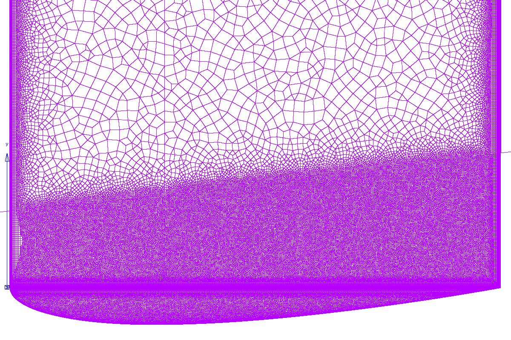
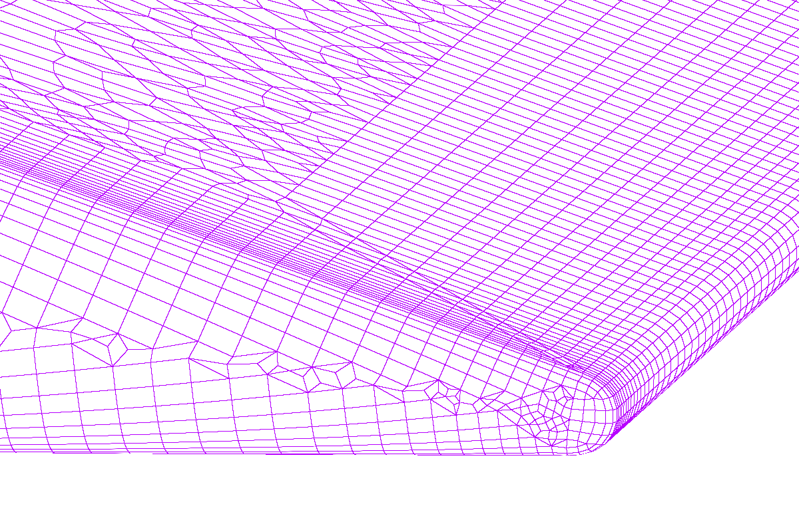

===============================================
Lessons Learned from Meshing the McAlister Case
===============================================

:Author: Chris Bruner, Dept. 01515, Sandia National Laboratories

Introduction
============
The series of wind-tunnel tests described by McAlister & Takahashi [McAl1991]_ 
have become something of a canonical test case in the rotorcraft community.
This is because the tests are well-documented and investigate both tip
and aspect ratio effects, and because the symmetric wing section used is 
fairly representative of those typically found on rotorcraft.

This case also serves as a reasonably good test case for wind energy 
applications as there are measurements of the trailing tip vortex far 
downstream, up to 13 chords. This is important to understand the 
grid requirements of our unstructured approach to modeling a full-scale
blade-resolved rotor and tower system.

Meshes
======
The meshes for this case are mixed structued/unstructured (hybrid) 
topologies. The mesh in the immediate vicinity of the wing uses a 
quad-dominant approach to produce mostly hexahedra in the wing boundary
layer. This has most of the advantages of an unstructured triangular mesh
in terms of ease of meshing and face isotropy in the interior, but has fewer
elements for a comparable node count. A potential disadvantage is that there
is no way to produce a mixed hex/tet mesh without the introduction of
pyramid elements, which can cause convergence and accuracy problems. There is
also a refined region around the tipe inside the wing box to ensure 
resolution of the formation of the wing tip vortex.

Further downstream, there is a fully structured hex mesh, expanding slightly
and covering the path of the tip vortex downstream as measured in the
experiment.

The balance of the test section mesh is unstructured tets (except as noted
below), while another structured block is used upstream of the test section.

The meshes first produced used the Discontinuous Galerkin (DG)
non-conformal interface between the hexahedral tip vortex mesh and the 
fully unstructured test section mesh. Due to the relative novelty of the
DG approach and our lack of familiarity with its performance in Nalu, it was
decided that a more conservative traditional, conformal interface between 
the blocks was preferable. Therefore, the tetrahedral test section block
interfaces to the hexahedral tip vortex block and the upstream block
using node-matched pyramid elements.

Notes on Geometry
-----------------
* The trailing edge geometry of the NACA0018 airfoil isn't given in either 
  the McAlister report nor in the original NACA publications describing it.
  Therefore, for ease of meshing, a rounded trailing edge was used.
* In order to capture at least the gross blockage effects, the model support 
  structure in the wind tunnel is modeled, and the tunnel walls are at the 
  correct locations. However, in and effort to keep the mesh size low, the 
  tunnel walls and the support are modeled as slip walls and not as viscous.
* Most of the McAlister cases of interest were performed using a square 
  wingtip. The initial mesh, however, uses the rounded tip described in 
  McAlister. We will eventually produce a square tip mesh as this is both 
  more interesting and has more-complete results.

Surface Mesh
------------

   The surface mesh near the tip, as viewed from above.

   A close-up view of the tip and trailing edge, showing rounded tip
   and trailing edge and quad-dominant surface mesh.

Statistics of Current Mesh (``grid07_conformal10.exo``)
-------------------------------------------------------
Node count:
    58M

Element Count:
    192M total, consisting of:

    * 158M tets
    * 2.5M pyramids
    * 1.1M wedges
    * 30M hexes

Max. Centroid Skew:
    0.866; 52 > 0.8

Max. Included Angle:
    177 degrees; 7 > 170 degrees

Max. Volume Ratio:
    22; 12 > 20 

Max. Aspect Ratio:
    346

Wall Spacing on Wing:
    :math:`8.8 \times 10^{-5}` m

T-Rex Growth Rate:
    1.2

Full/Max Layers in Tip Block:
    19/19 (limited to preserve quality)

Full/Max Layers in Wing Block:
    19/33

Lessons Learned
===============

* We need *a lot* of resolution to resolve and advect the tip vortex: on the 
  order of 2--3mm edge length.
* Due to the mathematics of physical space, small changes in the maximum edge 
  length in a block lead to large changes in the final mesh size.  For 
  example, changing the maximum edge length from 0.0025m to 0.003m produces 
  nearly a factor of 2 difference in the element count in the isotropic 
  portion of the mesh: :math:`(0.003/0.0025)^3 \approx 1.73`.
* Heuristically, volume ratios should ideally be < 20. Slightly larger volume 
  ratios are acceptable as long as there are no steep gradients passing 
  through these elements.
* Aspect ratios should be < 1000:1
* Centroid skewness is a better measure than the other skewness metrics as 
  it is more even across element topologies

  - equiangle skewness is also OK, but is stricter and can give misleadingly
    high readings for some tets
  - equivolume skewness is useless for tets

* Centroid skewness should be < 0.8; however, skewness as high as the low 
  0.9s (usually associated with topology transitions) is acceptable as long as:

  - the skewed cells are far away from large gradients; and
  - there are no more than a handful.

General Pointwise Tips
======================
* Maximum aspect ratio for quads in domains should be :math:`\le` 4 for 
  good quality extrusions.
* Maximum included angle should be :math:`\le` 170 degrees. The usual 
  exceptions for 
  regions with small gradients *should* apply here, but there may be 
  additional restrictions due to the elliptic nature of the incompressible 
  flow equations.
* It can be beneficial to push poor quality cells out of the boundary layer 
  by increasing the minimum number of T-Rex layers.
* One can set the maximum number of layers to prevent different numbers of 
  layers in a block and its adjacent domains. This can eliminate some 
  poor-quality tetrahedra.

References
==========
.. [McAl1991] McAlister, K. W. and R. K. Takahashi. *NACA 0015 Wing Pressure and Trailing Vortex Measurements*, NASA Technical Paper 3151. 1991.
