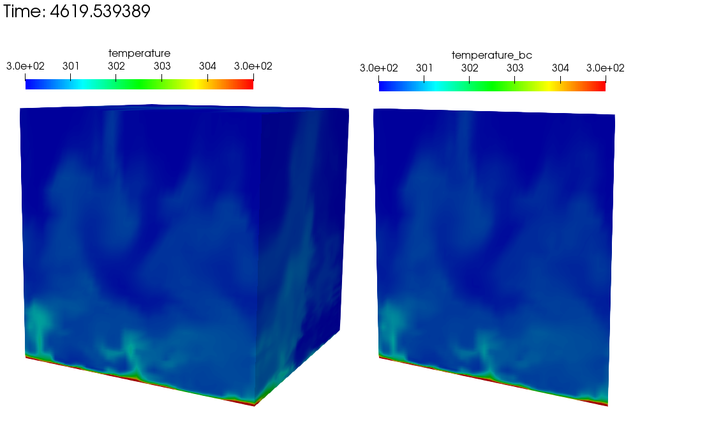
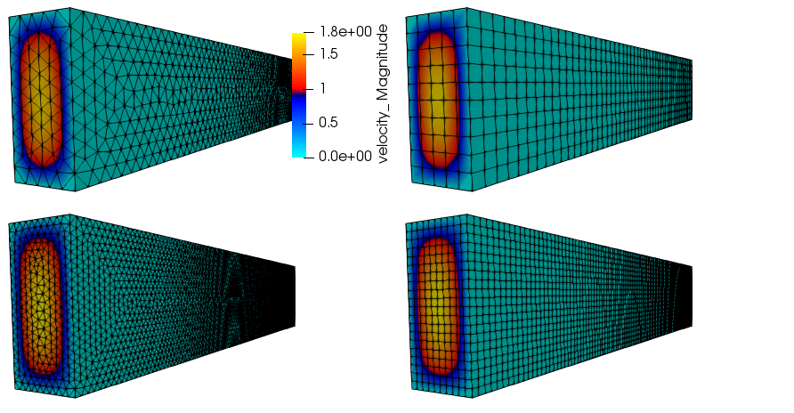
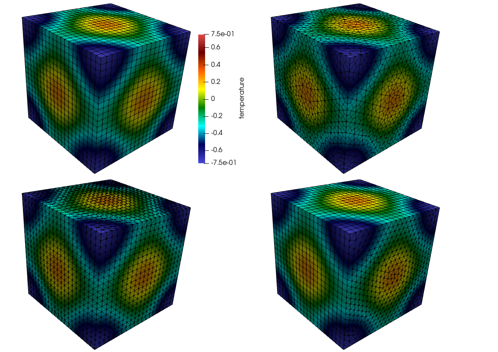
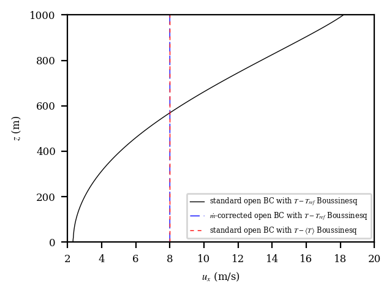
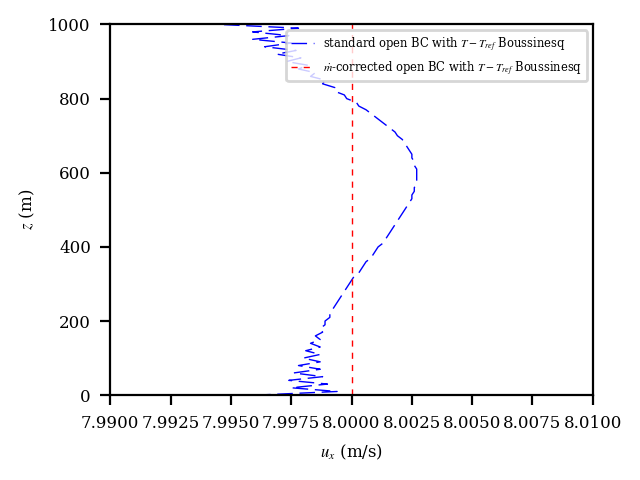
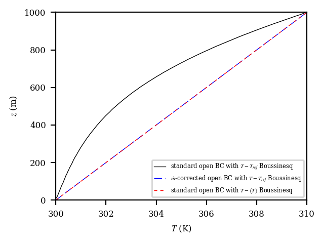
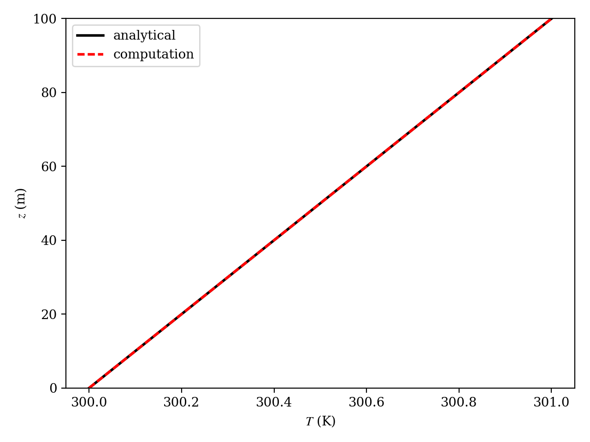
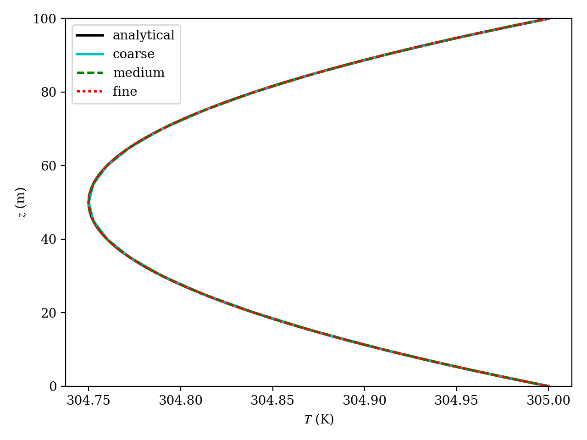

2D Unsteady Uniform Property: Convecting Decaying Taylor Vortex
---------------------------------------------------------------

Verification of first-order and second-order temporal accuracy for the
CVFEM and EBVC formulation in Nalu is performed using the method of
manufactured solution (MMS) technique. For the unsteady isothermal,
uniform laminar physics set, the exact solution of the convecting,
decaying Taylor vortex is used.

.. math::
   :label: advConvTV_u
   
   u = u_o - cos(\pi(x-u_ot)) sin(\pi(y-v_ot))e^{-2.0\omega t}
   

.. math::
   :label: advConvTV_v

   v = v_o + sin(\pi(x-u_ot)) cos(\pi(y-v_ot))e^{-2.0\omega t} 
   

.. math::
   :label: advConvTV_p
           
   p = -\frac{p_o}{4}(cos(2\pi(x-u_ot)) + cos(2\pi(y-v_ot)))e^{-4\omega t}
   

In this study, the constants :math:`u_o`, :math:`v_o`, and :math:`p_o`
are all assigned values of :math:`1.0`, and the viscosity :math:`\mu` is
set to a constant value of :math:`0.001`. The value of :math:`\omega` is
:math:`\pi^2\mu`. This particular viscosity value results in a maximum
cell reynolds number of twenty.

Temporal Order Of Accuracy Results
++++++++++++++++++++++++++++++++++

The temporal order of accuracy for the first order backward Euler and
second order BDF2 are outlined in Figure :numref:`fo-fourth-tstep` and
Figure :numref:`so-fourth-tstep`. Each of these simulations used a hybrid factor
of zero to ensure pure second order central usage. A fixed Courant
number of two was used for each of the three meshes (100x100, 200x200
and 400x400). The simulation was run out to 0.2 seconds and :math:`L_2`
error norms were computed. The standard fourth order pressure
stabilization scheme with time step scaling is used. This scheme is also
known as the standard incremental pressure, approximate pressure
projection scheme.

Two other pressure projection schemes have been evaluated in this study.
Each represent a simplification of the standard pressure projection
scheme. Figure :numref:`hybrid-tstep` outlines three projection schemes: the
first is when the projected nodal gradient appearing in the fourth-order
pressure stabilization is lagged while the second is the classic
pressure-free pressure approximate projection scheme with second order
pressure stabilization. The third is the baseline fourth-order
incremental pressure projection scheme. The error plots demonstrate that
lagging the projected nodal gradient for pressure retains second order
accuracy. However, as expected the pressure free pressure projection
scheme is confirmed to be first order accurate given the first order
splitting error noted in this fully implicit momentum solve.

The Steady Taylor Vortex will be used to verify the spatial accuracy for
the full set of advection operators supported in Nalu.

.. _fo-fourth-tstep:

.. figure:: figures/convTaylorVortexFO.pdf
   :width: 500px
   :align: center

   Error norms as a function of timestep size for the :math:`u` and
   :math:`v` component of velocity using fourth order pressure
   stabilization with timestep scaling, backward Euler

   
.. _so-fourth-tstep:
   
.. figure:: figures/convTaylorVortexSO.pdf
   :width: 500px
   :align: center

   Error norms as a function of timestep size for the :math:`u` and
   :math:`v` component of velocity using fourth order pressure
   stabilization with timestep scaling, BDF2

   
.. _hybrid-tstep:
   
.. figure:: figures/convTaylorVortexSO_ElemLagElemPf.pdf
   :width: 500px
   :align: center

   Error norms as a function of timestep size for the :math:`u` and
   :math:`v` component of velocity using the lagged projected nodal
   pressure gradient and pressure-free pressure projection scheme; all
   with with timestep scaling, BDF2

Higher Order 2D Steady Uniform Property: Taylor Vortex
------------------------------------------------------

A higher order unstructured CVFEM method has been developed by
Domino :cite:`Domino:2014`. A 2D structured mesh study
demonstrating second order time and third order in space scheme has been
demonstrated. The below work has emphasis on unstructured meshes.

Source Term Quadrature
++++++++++++++++++++++

Higher order accuracy is only demonstrated on solutions with source
terms when a fully integrated approach is used. Lumping the source term
evaluation is a second order error and is fully noted in the MMS study
(not shown).

Projected nodal gradients
+++++++++++++++++++++++++

Results show that one must use design order projected nodal gradients.
Figure :numref:`png-temp-mms` demonstrates a code verification result for a
steady thermal manufactured solution comparing lumped and consistent
mass matrix approaches for the projected nodal gradient on a quadratic
tquad mesh. In the lumped approach, a simple explicit algorithm is
processed while for the consistent approach, a simple mass matrix
inversion equation must be solved. The lumped approach is first order
while the consistent approach retains the expected second order as the
projected nodal gradient is expected to be order :math:`P`. Both
Dirichlet and periodic domains display the same order of convergence.

.. _png-temp-mms:

.. figure:: figures/ho_heatCondMMM_dtdx.pdf
   :width: 500px
   :align: center

   Error norms as a function of mesh size for a CMM and LMM projected
   nodal gradient on a quadratic tquad mesh.

Momentum and Pressure
+++++++++++++++++++++

The steady taylor vortex exact solution was run on a quadratic tquad
mesh. Figure :numref:`ho-stvmms` demonstrates the order of accuracy for
projected nodal gradients (pressure) and the velocity field
(x-component). Second order accuracy for the projected nodal gradient
(pressure) and third order for the velocity field is realized when the
consistent mass matrix approach is used for the projected nodal pressure
gradient. Note that this term is used in the pressure stabilization
approach. However, order of convergence for the projected nodal pressure
gradient and velocity field is compromised when the lumped mass matrix
approach is used for the pressure stabilization term. Note that both
approaches use the fully integrated pressure gradient term in the
momentum equation (i.e., :math:`\int p n_i dS`). Therefore, the reduced
order of integration for the projected nodal pressure gradient has
consequence on the velocity field order of convergence.

Again, dirichlet (inflow) and periodic domains display the same order of
convergence.

.. _ho-stvmms:

.. figure:: figures/ho_stvUandDpDx.pdf
   :width: 500px
   :align: center

   Error norms as a function of mesh size for the Steady Taylor Vortex
   momentum and pressure gradient field.

3D Steady Non-isothermal with Buoyancy
--------------------------------------

Building from the basic functional form of the Taylor Vortex, a
non-isothermal solution (momentum, pressure and static enthalpy) is
manufactured as follows:

.. math::
     :label: threed-non-iso

     u &= -u_o cos(a \pi x) sin(a \pi y ) sin(a \pi z)  \\
     v &= +v_o sin(a \pi x) cos(a \pi y ) sin(a \pi z)  \\
     w &= -w_o sin(a \pi x) sin(a \pi y ) cos(a \pi z)  \\
     p &= -\frac{p_o}{4}( cos(2 a \pi x) + cos(2 a \pi y ) + cos(2 a \pi z) )   \\
     h &= +h_o cos(a_h \pi x) cos(a_h \pi y ) cos(a_h \pi z)  

The equation of state is simply the ideal gas law,

.. math::
   :label: ideal-gas-eos1
   
   \rho = \frac{P^{ref} M}{R T}
   

The simulation is run on a three-dimensional domain ranging from
-0.05:+0.05 with constants
:math:`a, a_h, M, R, C_p, P^{ref}, T_{ref}, Pr, \mu` equal to (20, 10,
30, 10, 0.01, 100, 300, 0.8, 0.00125), respectively.

At reference conditions, the density is unity. The effects of buoyancy
are also provided by an arbitrary gravity vector of magnitude of
approximately ten, :math:`g_i = (-5, 6, 7)^T`. On this domain, the
enthalpy ranges from zero to unity. Given the reference values, the
temperature field ranges from 300K to 400K which is designed to mimic a
current LES non-isothermal validation suite.

Edge- and element-based discretization (P=1) demonstrate second order
convergence in the :math:`L_2` norm for u, v, w and temperature. This
test is captured within the variableDensityMMS regression test suite.

3D Steady Non-uniform with Buoyancy
-----------------------------------

Building from the basic functional form of the Taylor Vortex, a
non-uniform solution (momentum, pressure and mixture fraction) is
manufactured as follows:

.. math::
   :label: threed-noniso

   u &= -u_o cos(a \pi x) sin(a \pi y ) sin(a \pi z)  \\
   v &= +v_o sin(a \pi x) cos(a \pi y ) sin(a \pi z)  \\
   w &= -w_o sin(a \pi x) sin(a \pi y ) cos(a \pi z)  \\
   p &= -\frac{p_o}{4}( cos(2 a \pi x) + cos(2 a \pi y ) + cos(2 a \pi z) )   \\
   z &= +z_o cos(a_z \pi x) cos(a_z \pi y ) cos(a_z \pi z)  
   

The equation of state is simply the standard inverse mixture fraction
property expression for density,

.. math::
   :label: ideal-gas-eos2
   
   \rho = \frac{1} {\frac{z}{rho^P} + \frac{1-z}{rho^S} }
   

The simulation is run on a three-dimensional domain ranging from
-0.05:+0.05 with constants :math:`a, a_z, \rho^p, \rho^s, Sc, \mu` equal
to (20, 10, 0.1, 1.0, 0.8, 0.001), respectively.

At reference conditions, the density is that of the primary condition
(0.1). The effects of buoyancy are also provided by an arbitrary gravity
vector of magnitude of approximately ten, :math:`g_i = (-5, 6, 7)^T`. On
this domain, the mixture fraction ranges from zero to unity. This test
case is designed to support the helium plume DNS study with primary and
secondary density values of helium and air, respectively.

Edge- and element-based discretization (P=1) demonstrate second order
convergence in the :math:`L_2` norm for u, v, w and mixture fraction.
This test is captured within the variableDensityMMS regression test
suite.

2D Steady Laplace Operator
--------------------------

The evaluation of the low-Mach Laplace (or diffusion operator) is of
great interest to the core supported application space. Although the
application space for Nalu is characterized by a highly turbulent flow,
the usage of an approximate pressure projection scheme always makes the
chosen Laplace form important. Although the element-based scheme is
expected to be accurate, it can be problematic on high aspect ratio
meshes as element-based schemes are not gauranteed to be monotonic for
aspect ratios as low as :math:`\sqrt{2}` for FEM-based schemes and
:math:`\sqrt{3}` for CVEM-based approaches (both when using standard
Gauss point locations). Conversely, while the edge-based operator is
accurate on high aspect ratio meshes, it suffers on skewed meshes due to
both quadrature error and the inclusion of a non orthogonal correction
(NOC).

In order to assess the accuracy of the Laplace operator, a the
two-dimensional MMS temperature solution is used. The functional
temperature field takes on the following form:

.. math::
   :label: adv-conv-tv-u
   
   T = \frac{\lambda}{4} (cos(2 a \pi x) + cos(2 a \pi y)).
   

The above manufactured solution is run on three meshes of domain size of
1x1. The domain was first meshed as a triangular mesh and then converted
to a tquad4 mesh. Therefore, non orthogonal correction (NOC) effects are
expected for the edge-based scheme. In this study, both :math:`\lambda`
and :math:`a` are unity. Either periodic or Dirichlet conditions are
used for boundary conditions.

A brief overview of the diffusion operator tested is now provided. For
more details, consult the theory manual. The general diffusion kernel is
as follows:

.. math::
   :label: diff-op
   
   -\int \Gamma \frac{\partial \phi}{\partial x_j} A_j.
   

The choice of the gradient operator at the integration point is a
functin of the underlying method. For CVFEM, the gradient operator is
provided by the standard shape function derivatives,

.. math::
   :label: cvfem-derivative2
   
   \frac{\partial \phi_{ip}}{\partial x_j} = \sum \frac{\partial N^{ip}_{j,k}} {\partial x_j} \phi_k.
   

For the edge-based scheme, a blending of an orthogonal gradient along the edge and a NOC is employed,

.. math::
   :label: general-grad

   \frac{\partial \phi_{ip}}{\partial x_j} = \bar{G_j\phi} + \left[ \left(\phi_R - \phi_L \right) 
   - \bar{G_l\phi}dx_l \right] \frac{A_j}{A_k dx_k}.

In the above equation, :math:`G_j\phi` is a projected nodal gradient. The general equation for this quantity is

.. math::
   :label: png
   
   \int w_I G_j \phi {dV} = \int w_i \frac{\partial \phi}{\partial x_j}{dV}.
   

Possible forms of this include either lumped or consistent mass (the
later requires a global equation solve) with either the full CVFEM
stencil or the edge-based (reduced) stencil. The above equation can even
be applied within the element itself for a simple, local integration
step that provides a piecewise constant gradient over the element.

The simulation study is run with the following diffusion operators: 1)
the standard CVFEM operator, 2) the edge-based operator with CVFEM
projected nodal gradients (NOC), 3) the edge-based operator with
edge-based projected nodal gradients (NOC), 4) the edge-based operator
without NOC correction, 5) the CVFEM operator with shifted integration
points to the edge, and, lastly, 6) a mixed edge/element scheme in which
the orthogonal diffuion operator is edge-based while the NOC terms are
based on the elemental CVFEM gradient (either evaluated at the given
integration point or integrated over the element for a piecewise
constant form).

The last operator is interesting in that it represents a candidate
operator for the CVFEM pressure Poisson system when high aspect ratio
meshes are used. Figure :numref:`laplace-tquad-a` outlines the convergence
of the five above operators; shown are all of the standard norms
(:math:`\infty`, :math:`1` and :math:`2`) for the R0, R1 and R2 mesh refinements. The results
in the left side of the figure indicate that the edge-based scheme with
NOC retains second-order convergence for all norms when the more
accurate CVFEM projected nodal gradient is used (lumped only tested
given its good results). Convergence is degraded with the edge-based
scheme when NOC terms are either neglected or use the reduced edge-based
projected nodal gradient. The CVFEM-based methods are second order
accurate in the :math:`L_1` and :math:`L_2` norms, however, questionable
results are noted in the :math:`L_{\infty}` norm for all methods that
include any shape function derivative for local or elemental piecwise
constant gradient operators. Shifting the Gauss points from the standard
subcontrol surface to the edges of the element (while still using shape
function derivatives) is only problematic in the :math:`L_{\infty}` norm
(just as the standard CVFEM approach). The use of the mixed-approach
with a piecewise constant gradient over the element demonstrates the
same behavior as when using the integration point CVFEM gradient
operator. Figure :numref:`laplace-tquad-b` outlines two more refinement
meshes for the CVFEM operator (R3 and R4). Results indicate that the
:math:`L_{\infty}` norm is approaching second order accuracy.

.. _laplace-tquad-a:

.. figure:: figures/tquadLaplaceMMS.pdf      
   :width: 500px
   :align: center

   Error norms for tquad4 refinement study. 
   R0, R1, and R2 refinement.      

.. _laplace-tquad-b:

.. figure:: figures/tquadLaplaceMMSCVFEM.pdf
   :width: 500px
   :align: center

   Error norms for tquad4 refinement study. 
   R0, R1, R2, R3, R4, and R4 refinementError for CVFEM.

An inspection of the magnitude of error between the exact and computed
temperature for the R3 mesh is shown in Figure :numref:`tquad-tdiff`. Results
show that the CVFEM error is highest at the corner mesh nodes that form
a reduced stencil. The edge-based scheme shows increased error at the
higher aspect ratio dual mesh.

.. _tquad-tdiff:

.. figure:: figures/tquadEdgeCvfemTdiff.pdf
   :width: 500px
   :align: center

   Magnitude of the :math:`L_{\infty}` temperature norm comparing the
   edge-based CVFEM (NOC) and standard CVFEM operators on the R3 mesh.

3D Steady Laplace Operator with Nonconformal Interface
------------------------------------------------------

A three dimensional element-based verification study is provided to
evaluate the DG-based CVFEM approach.

.. math::
   :label: threed-t
   
   T = \frac{\lambda}{4} (cos(2 a \pi x) + cos(2 a \pi y) + cos(2 a \pi z)).
   

Figure :numref:`laplace-nc` represents the MMS field for temperature. The
simulation study includes uniform refinement of a first- and
second-order CVFEM basis. Both temperature field and projected nodal
gradient norms are of interest.

.. _laplace-nc:

.. figure:: figures/dgNonconformalCVFEM_3dTempMMS_tempField.pdf
   :width: 500px
   :align: center

   MMS temperature field for nonconformal algorithm.

Figure :numref:`laplace-ncoc-a` outlines the linear and quadratic basis.
For P1, the CVFEM temperature field predicts between second and first
order while for P2, third order is recovered. When using a consistent
mass matrix for the projected nodal gradient, second order is noted, see
Figure :numref:`laplace-ncoc-b`.

.. _laplace-ncoc-a:

.. figure:: figures/dgNonconformalCVFEM_3dTempMMS_OoC.pdf
   :width: 500px
   :align: center

   MMS order of accuracy for nonconformal algorithm.
   Temperature norms for P1 and P2 elements.
   
.. _laplace-ncoc-b:

.. figure:: figures/dgNonconformalCVFEM_3dTempMMS_OoCPNG.pdf
   :width: 500px
   :align: center

   MMS order of accuracy for nonconformal algorithm.
   Projected nodal gradient norms for P1 and P2 elements.

.. _linear-patch:

+---------------+---------------------+---------------+---------------+
| dof           | :math:`L_{\infty}`  | L1            | L2            |
+===============+=====================+===============+===============+
| temperature   | 3.33067e-16         | 2.30077e-17   | 4.68103e-17   |
+---------------+---------------------+---------------+---------------+
| dTdx          | 4.13225e-13         | 9.06848e-15   | 1.98249e-14   |
+---------------+---------------------+---------------+---------------+
| dTdy          | 4.15668e-13         | 1.11256e-14   | 2.15065e-14   |
+---------------+---------------------+---------------+---------------+
| dTdz          | 4.31211e-13         | 9.60785e-15   | 1.97517e-14   |
+---------------+---------------------+---------------+---------------+

Given the order of accuracy results for the P1 implementation, a linear
patch test was run. The temperature solution was simply,
:math:`T(x,y,z) = x + y + z`; all analytical temperature gradients are
unity. Table :numref:`linear-patch` demonstrates the successful patch test
results for a P1 CVFEM implementation.

Precursor-based Simulations
------------------------------------------------------
In the field of turbulent flow modeling and simulation, often times simulations
may require sophisticated boundary conditions that can only be obtained 
from previously run high-fidelity simulations. For example, consider a
typical turbulent jet simulation in which the experimental inlet condition
was preceeded by a turbulent pipe entrance region. Furthermore, in
most cases the ability to adequately predict the developing jet flow regime may be
highly sensitive to proper inlet conditions. Figure :numref:`inlet-pipe` and
Figure :numref:`inlet-pipe-jet` outline a process in which a high fidelity 
large-eddy simulation of a periodic pipe was used to determine a representative
inlet condition for a turbulent round jet. Specifically, a precursor pipe flow
simulation is run with velocity provided to an output file. This output file serves
as the inlet velocity profile for the subsequent simulation.

.. _inlet-pipe:

.. figure:: figures/openJetInlet.pdf
   :width: 500px
   :align: center

   Precursor periodic pipe flow large-eddy simulation that will
   serve as the inlet boundary condition for a subsequent turbulent jet simulation.

.. _inlet-pipe-jet:

.. figure:: figures/openJetFlowStill.pdf
   :width: 500px
   :align: center

   Subsequent turbulent jet simulation using the precursor data obtained by
   a periodic pipe flow.

In the above use case, as with most general simulation studies, the mesh resolution 
for the precursor simulation may be different from the subsequent simulation. Moreover, 
the time scale for the precursor simulation may be much shorter than the subsequent
simulation. Finally, the data required for the subsequent simulation will likely be at
different time steps unless an overly restrictive rule is enforced, i.e., a fixed timestep
for each simulation. 

In order to support such use cases, extensive usage of the the Sierra Toolkit infrastructure 
is expected, most notably within the IO and Transfer modules. The IO module can be used to interpolate 
the precursor simulation boundary data to the appropriate time required by the subsequent 
simulation. Specifically, the IO module linearly interpolates between the closest data interval in the
precursor data set. A recycling offset factor is included within the IO interface that allows
for the cycling of data over the full time scale of interest within the subsequent simulation. For 
typical statistically stationary turbulent flows, this is useful to ensure proper statistics
are captured in subsequent runs.

After the transient data set from the precursor simulation is interpolated to the proper time, 
the data is spatially interpolated and transferred to the subsequent simulation mesh using the 
STK Transfer module. Efficient coarse parallel searches (point/bounding box) provide the list of 
candidate owning elements on which the fine-scale search operates to determine the best search 
candidate. The order of spatial interpolation depends on the activated numerical discretization. 
Therefore, by combining the two STK modules, the end use case to support data transfers of
boundary data is supported.

As noted, there are many other use cases in addition to the overviewed turbulent jet simulation
that require such temporal/spatial interpolation capabilities. For example, in typical wind 
farm simulation applications, a proper atmospheric boundary layer (ABL) configuration is required
to capture a given energy state of the boundary layer. In this case, a periodic precusor ABL is run 
with the intent of providing the inlet condition to the subsequent wind farm domain. As with the 
previous description, the infrustructure requirements remain the same.

Finally, the general creation of an "input_output" region can be useful in validation cases
where data are provided at a subset of the overall simulation domain. Such is the case in PIV and
PLIF experimental data sets. Although the temporal interpolation is not required, the transfer
of this data at high time step frequency is useful for post-processing.

In this verification section, a unit test approach will be referenced that is captured within the
STK module test suite. This foundational test coverage provides confidence in the underlying IO and 
parallel search/interpolation processes. In addition to briefly describing the infrastructure testing,
application tests are provided as further evidence of correctness. The application test first is based 
on the convecting Taylor vortex verification case while the second is the ABL precursor application space
demonstration.

Infrastructure Unit Test
++++++++++++++++++++++++
As noted above, the Nalu application code leverages the STK unit tests within the IO and transfer
modules. Interested parties may peruse the STK product under a cloned Trilinos cloned project,
i.e., Trilinos/packages/stk/stk_doc_test. Under the STK product, a variety of search, transfer and 
input/output tests exist. For example, interpolation in time using the IO infrastructure is captured 
in addition to a variety of search and transfer use cases.

Application Verification Test; Convecting Taylor Vortex
+++++++++++++++++++++++++++++++++++++++++++++++++++++++
Although the foundational infrastructure tests are useful, the application must adequately interface
the IO and Transfer modules to support the end use case. In this section, two tests
will be demonstrated that illustrate the precursor/subsequent simulation use case.

The first test considered will be the convecting Talor vortex. In this configuration,
a very fine mesh simulation is run with boundary conditions specified in the input file
to be of type, "convecting_taylor_vortex". This specifies the analytical function
for the x-component of velocity as provided in Equation :eq:`advConvTV_u`. The simulation
is run while providing output to a Realm of type "input_output" using a transfer objective,
"input_output". The transient data is then used 
for a series of mesh refinement studies. The viscosity is set at 0.001 while the domain is
1x1. In this study, the edge-based scheme is activated, however, the precursor interpolation
methodology is not sensitive to the underlying numerical method.

In Figure :numref:`ctv-precursor`, a plot between the analytical x-component of velocity
and a nodal query of the outputted velocity component is provided. Although not immediately
apparent, the values are exactly the same. This finding confirms that the data set output
is consistent with the nodal exact value.

.. _ctv-precursor:

.. figure:: figures/U_x_precursor.pdf
   :width: 500px
   :align: center

   Temporal plot of the exact x-velocity component and precursor output.

With the precursor data base containing the full transient data, a refinement
study can be accomplished to determine numerical errors. Although the full machinery
for temporal and spatial interpolation is active, the data requirement at the coarse simulations
are represented as the subsets of the full data - both in space and time. As such, no numerical
degradation of second-order accuracy is expected. The subsequent simulations are run with an
"external_data" transfer objective and a Realm of type, "external_data_provider".

In Figure :numref:`ctv-l2`, a plot of :math:`L_2` norms of the x-component of velocity are shown 
for the subsequent set of simulations that use the precursor data. Results of this study verify
both the second-order temporal accuracy of the underlying numerical scheme and the process
of using both space and time interpolation.

.. _ctv-l2:

.. figure:: figures/U_x_CTV_subsequent_L2.pdf
   :width: 500px
   :align: center

   Temporal accuracy plot of the x-velocity component norms using the precursor data.

Application Verification Test; ABL Precursor/Subsequent
+++++++++++++++++++++++++++++++++++++++++++++++++++++++

The second, and final application test is an ABL-based simulation that first runs a precursor periodic
solution in order to capture an appropriate ABL specification. The boundary data saved from the precursor
simulation are then used as an inflow boundary condition for the subsequent ABL simulation. As the precurosr 
is run for a smaller time frame than the subsequent simulation, the usage of data cycling is active. This 
full integration test is captured within the regression test suite. The simulation is described as a non-isothermal 
turbulent flow.

In Figure :numref:`abl-susequent-cycle`, the transient recycling of the ABL thermal inflow boundary
condition is captured at an arbitrary nodal location very near the wall boundary condition. The subsequent 
simulation reads the precursor data set for time zero seconds until 3000 seconds at which time it recylces 
the inlet condition back to the initial precursor simulation time, i.e., zero seconds. An interesting note in this 
study is the fact that the precursor periodic simulation, which was run at the same Courant number, was using time 
steps approximately three times greater than the subsequent inflow/open configuration.  

.. _abl-susequent-cycle:

.. figure:: figures/abl_sub_cycle_T.pdf
   :width: 500px
   :align: center

   Transient recycling of the temperature inflow boundary condition for the subsequent ABL simulation. After
   3000 seconds, the inflow boundary condition is recycled from the begining of the precursor simulation.

In Figure :numref:`abl-susequent-check-one-two`, (left) the subsequent simulation inflow temperature field and 
full profile over the full domain is captured at approximately 4620 seconds. On the right of the figure, the 
temperature boundary condition data that originated from the precursor simulation, which was read into the subsequent 
"external_field_provider" Realm, is shown (again at approximately 4620 seconds).

.. _abl-susequent-check-one:

   Subsequent simulation showing the full temperature domain (left) and on the precursor inflow temperature boundary 
   condition field obtained from the perspective of the subsequent "external_field_provider" Realm (right).

Boussinesq Verification
--------------------------------------

Unit tests
+++++++++++++++++++++++++++++++++++++++++++++++++++++++

Unit-level verification was performed for the Boussinesq body force term :eq:`boussbuoy` with a 
nodal source appropriate to the edge-based scheme (MomentumBoussinesqSrcNodeSuppAlg.single_value) as well as a 
separate unit test for the element-based "consolidated" Boussinesq source term 
(MomentumKernelHex8Mesh.buoyancy_boussinesq).  Proper volume integration with different element topologies is 
also tested (the "volume integration" tests in the MasterElement and HOMasterElement test cases).

Stratified MMS
+++++++++++++++++++++++++++++++++++++++++++++++++++++++

A convergence study using the method of manufactured solutions (MMS) was also performed to assess the integration 
of the source term into the governing equations. An initial condition of a Taylor-Green vortex for velocity, a zero-
gradient pressure field, and a linear enthalpy profile in the z-direction are imposed.

.. math::
   :label: threed-boussinesq

   u &= -\frac{1}{2} cos(2 \pi x) sin(2 \pi y ) sin(2 \pi z)  \\
   v &=  sin(2 \pi x) cos(2 \pi y ) sin(2 \pi z)  \\
   w &= -\frac{1}{2} sin(2 \pi x) sin(2 \pi y ) cos(2 \pi z)  \\
   p &= 0  \\
   h &= z.

The simulation is run on a three-dimensional domain ranging from -1/2:+1/2 with reference density,
reference temperature and the thermal expansion coefficient to equal to 1, 300,  and 1, respectively.  
:math:`\beta` is much larger than typical (:math:`1 / T_{\rm ref}`)  so that the buoyancy term is a 
significant term in the MMS in this configuration.

The Boussinesq buoyancy model uses a gravity vector of magnitude of ten in the z-direction 
opposing the enthalpy gradient, :math:`g_i = (0, 0, -10)^T`. The temperature for this test ranges
between 250K and 350K.  The test case was run with a regular hexahedral mesh, using the edge-based 
vertex centered finite volume scheme.  Each case was run with a fixed maximum Courant number of 0.8 
relative to the specified solution.

.. table:: Error in x-component of velocity
   :widths: grid

   +---------------+---------------------+---------------+---------------+-------+
   | h             | :math:`L_{\infty}`  | L1            | L2            | Order |
   +===============+=====================+===============+===============+=======+
   | 1/32          | 8.91e-3             | 1.12e-3       | 1.77e-3       | NA    |
   +---------------+---------------------+---------------+---------------+-------+
   | 1/64          | 2.03e-3             | 3.04e-4       | 4.27e-4       | 2.05  |
   +---------------+---------------------+---------------+---------------+-------+
   | 1/128         | 4.65e-4             | 7.64e-5       | 1.05e-4       | 2.03  |
   +---------------+---------------------+---------------+---------------+-------+

.. table:: Error in y-component of velocity
   :widths: grid

   +---------------+---------------------+---------------+---------------+-------+
   | h             | :math:`L_{\infty}`  | L1            | L2            | Order |
   +===============+=====================+===============+===============+=======+
   | 1/32          | 1.78e-2             | 2.31e-3       | 3.47e-3       | NA    |
   +---------------+---------------------+---------------+---------------+-------+
   | 1/64          | 4.18e-3             | 5.92e-4       | 8.23e-4       | 2.06  |
   +---------------+---------------------+---------------+---------------+-------+
   | 1/128         | 9.70e-4             | 1.50e-4       | 2.02e-4       | 2.03  |
   +---------------+---------------------+---------------+---------------+-------+

.. table:: Error in z-component of velocity
   :widths: grid

   +---------------+---------------------+---------------+---------------+-------+
   | h             | :math:`L_{\infty}`  | L1            | L2            | Order |
   +===============+=====================+===============+===============+=======+
   | 1/32          | 8.68e-2             | 1.17e-3       | 1.73e-3       | NA    |
   +---------------+---------------------+---------------+---------------+-------+
   | 1/64          | 2.00e-3             | 2.99e-4       | 4.22e-4       | 2.04  |
   +---------------+---------------------+---------------+---------------+-------+
   | 1/128         | 4.64e-4             | 7.63e-5       | 1.05e-4       | 2.00  |
   +---------------+---------------------+---------------+---------------+-------+

.. table:: Error in temperature
   :widths: grid

   +---------------+---------------------+---------------+---------------+-------+
   | h             | :math:`L_{\infty}`  | L1            | L2            | Order |
   +===============+=====================+===============+===============+=======+
   | 1/32          | 1.09e-2             | 1.46e-3       | 2.10e-3       | NA    |
   +---------------+---------------------+---------------+---------------+-------+
   | 1/64          | 2.06e-3             | 3.13e-4       | 4.19e-4       | 2.32  |
   +---------------+---------------------+---------------+---------------+-------+
   | 1/128         | 4.18e-4             | 7.54e-5       | 1.00e-4       | 2.06  |
   +---------------+---------------------+---------------+---------------+-------+

This test is added to Nalu's nightly test suite, testing that the convergence rate between 
the 1/32 and 1/64 element sizes is second order.

3D Hybrid 1x2x10 Duct: Specified Pressure Drop
----------------------------------------------
In this section, a specified pressure drop in a simple 1x2x10 configuration is run with
a variety of homogeneous blocks of the following topology: hexahedral, tetrahedral, wedge,
and thexahedral. This analytical solution is given by an infinite series and is coded
as the "1x2x10" user function. The simulation is run with an outer wall boundary condition
with two open boundary conditions. The specified pressure drop is 0.016 over the 10 cm 
duct. The density and viscosity are 1.0e-3 and 1.0e-4, respectively. The siumulation
study is run a fixed Courant numbers with a mesh spacing ranging from 0.2 to 0.025.
Figure :numref:`specified-dp-flow-hex-tet` provides the standard velocity profile for the 
structured hexahedral and unstructured tetrahedral element type.

.. _specified-dp-flow-hex-tet:

   Streamwise velocity profile for specified pressure drop flow; tetrahedral and hexahedral topology.

The simulation study employed a variety of elemental topologies of uniform mesh spacing
as noted above. Figure :numref:`specified-dp-l2` outlines the convergence in the :math:`L_2`
norm using the low-order elemental CVFEM implementation using the recently changed tetrahedral
and wedge element quadrature rules. Second-order accuracy is noted. Interestingly, the 
hexahedral and wedge topology provided nearly the same accuracy. Also, the tetrahedral
accuracy was approximately four tiomes greater. Finally, the Thexahedral topology
proved to be second-order, however, provided very poor accuracy results. 

.. _specified-dp-l2:

.. figure:: figures/Uz_L2_dp.pdf
   :width: 500px
   :align: center

   :math:`L_2` error for the CVFEM scheme on a variety of element types.

3D Hybrid 1x1x1 Cube: Laplace
-----------------------------
The standard Laplace operator is evalued on the full set of low-order hybrid topologies 
(not inlcuding the pyramid). In this example, the temperature field is again,

.. math::
   :label: threed-L
   
   T = \frac{\lambda}{4} (cos(2 a \pi x) + cos(2 a \pi y) + cos(2 a \pi z)).

Figure :numref:`laplace-hybrid` represents the MMS field for temperature
on a variety of mesh topologies. The thexahedral mesh is obtained from the
standard uniform spacing tetrahedral mesh (not shown). The tetrahedral
mesh shown is a tet-based conversion of the standard structured hexahedral
mesh. This approach ensures that the number of nodes between the hexahedral
and tetrahedral mesh are the same.

.. _laplace-hybrid:

   Temperature shadings for hexahedral, thexahedral, wedge, and tetrahedral topologies (clockwise from the upper left).

Figure :numref:`laplace-hybrid-l2` provides the :math:`L_2` norms, all of which are showing second-order accuracy.
In Figure :numref:`laplace-hybrid-lo`, the :math:`L_o` error is shown. As indicated from the convergence plot,
slight degradation in order-of-accuracy is noted for the thexahedral topology.

.. _laplace-hybrid-l2:

.. figure:: figures/hybrid_T_L2.pdf
   :width: 500px
   :align: center

   :math:`L_2` norms for the full set of hybrid Laplace MMS study.

.. _laplace-hybrid-lo:

.. figure:: figures/hybrid_T_Loo.pdf
   :width: 500px
   :align: center

   :math:`L_o` norms for the full set of hybrid Laplace MMS study.

Open Boundary Condition With Outflow Thermal Stratification
----------------------------------------------------------------
In situations with significant thermal stratification at the outflow of the domain, the standard open boundary
condition alone is not adequate because it requires the specification of motion pressure at the boundary, and
this is not known *a priori*.  Two solutions to this problem are: 1) to use the global mass flow rate correction
option, or 2) to use the standard open boundary condition in which the buoyancy term uses a local time-averaged
reference value, rather than a single reference value.

We test these open boundary condition options on a simplified stratified flow through a channel with slip walls.  The
flow entering the domain is non-turbulent and uniformly 8 m/s.  The temperature linearly varies from 300 K to 310 K from 
the bottom to top of the channel with compatible, opposite-sign heat flux on the two walls to maintain this profile.
The Boussinesq buoyancy option is used, and the density is set constant to 1.17804 kg/m :math:`^3`. This density is 
compatible with the reference pressure of 101325 Pa and a reference temperature of 300 K.  The viscosity is set to 
1.0e-5 Pa-s.  *The flow should keep its inflow velocity and temperature profiles throughout the length of the domain*.

The domain is 3000 m long, 1000 m tall, and 20 m wide with 300 x 100 x 2 elements.  The upper and lower boundaries 
are symmetry with the specified normal gradient of temperature option used such that the gradient matches the initial
temperature profile with its gradient of 0.01 K/m. Flow enters from the left and exits on the right.  The remaining 
boundaries are periodic. 

We test the problem on three configurations: 1) using the standard open boundary condition, 
2) using the global-mass-flow-rate-correction option, and 3) using the standard open boundary condition with a local
moving-time-averaged reference temperature in the Boussinesq buoyancy term.

Figure :numref:`stratified_outflow_ux1` shows the across-channel profile of outflow streamwise velocity.  It is clear
that in configuration 1, the velocity is significantly distorted from the correct solution.  Configurations 2 and 3 
remedy the problem.  However, if we reduce the range of the x-axis, as shown in Figure :numref:`stratified_outflow_ux2`, 
we see that configuration 3, the use of the standard open boundary condition with a local moving-time-averaged
Boussinesq reference temperature, provides a superior solution in this case.  In Figure, :numref:`stratified_outflow_T1`,
we also see that configuration 1 significantly distorts the temperature from the correct solution.

.. _stratified_outflow_ux1:

   Outflow velocity profiles for the thermally stratified slip-channel flow.

.. _stratified_outflow_ux2:

   Outflow velocity profiles for the thermally stratified slip-channel flow considering only the case with the
   global mass-flow-rate correction and the standard open boundary with the local moving-time-averaged Boussinesq
   reference value.

.. _stratified_outflow_T1:

   Outflow temperature profiles for the thermally stratified slip-channel flow.

We also verify that the global mass-flow-rate correction of configuration 2 is correcting the outflow mass flow rate 
properly.  The output from Nalu showing the correction is correct and is shown as follows:

.. code-block:: c++
 
   Mass Balance Review:
   Density accumulation: 0
   Integrated inflow:    -188486.0356751138
   Integrated open:      188486.035672821
   Total mass closure:   -2.29277e-06
   A mass correction of: -2.86596e-09 occurred on: 800 boundary integration points:
   Post-corrected integrated open: 188486.0356751139

Specified Normal Temperature Gradient Boundary Condition
--------------------------------------------------------

The motivation for adding the ability to specify the boundary-normal temperature 
gradient is atmospheric boundary layer simulation in which the upper portion of
the domain often contains a stably stratified layer with a temperature gradient
that extends all the way to the upper boundary.  The desire is for the simulation
to maintain that gradient throughout the simulation duration.  

Our test case is a laminar infinite channel with slip walls.  In this case, the 
flow velocity is zero so the problem is simply a heat conduction through fluid.
The density is fixed as constant, and there are no source terms including
buoyancy.

This problem has an the analytical solution for the temperature profile across 
the channel:

.. math::
   :label: T-slip-channel

   T(t,z) = T(t_0,z_0) + \frac{-g_H-g_0}{H} \kappa_{eff} (t-t_0) + g_0 (z-z_0) + \frac{-g_H-g_0}{2H} (z-z_0)^2,

where :math:`t_0` is the initial time; :math:`z_0` is the height of the lower 
channel wall; :math:`H` is the channel height; :math:`g_0` and :math:`g_H` are
the wall-normal gradients of temperature at the lower and upper walls, respectively;
:math:`\kappa_{eff}` is the effective thermal diffusivity;
and :math:`z` is the distance in the cross-channel direction.  The sign of the 
temperature gradients assumes that boundary normal points inward from the boundary.
For this solution to hold, the initial solution must be that of :eq:`T-slip-channel` 
with :math:`t=t_0`.

For all test cases, we use a domain that is 10 m x 10 m in the periodic (infinite) directions,
and 100 m in the cross-channel (z) direction.  We specify a constant density of 
1 kg/m :math:`^3`, zero velocity, no buoyancy source term, a viscosity of 1 Pa-s,
and a laminar Prandtl number of 1.  No turbulence model is used. The value of
:math:`T(t_0,z_0)` is 300 K.

Simple Linear Temperature Profile: Equal and Opposite Specified Temperature Gradients
+++++++++++++++++++++++++++++++++++++++++++++++++++++++++++++++++++++++++++++++++++++

A simple verification test that is representative of a stable atmospheric capping
inversion is to compute the simple thermal channel with equal and opposite specified
temperature gradients on each wall.  By setting :math:`g_H = - g_0` in Equation 
:eq:`T-slip-channel`, we are left with

.. math::
   :label: T-slip-channel-linear

   T(z) = T(z_0) + g_0 (z-z_0).

In other words, if we set the initial temperature profile to that of :eq:`T-slip-channel-linear`,
with :math:`g_H = -g_0`, the profile should remain fixed for all time.  In this case,
we set :math:`g_0 = 0.01` K/m and :math:`g_H = -0.01` K/m.

We use a mesh that 2 elements wide in the periodic directions and 20 elements across
the channel.  We simulate a long time period of 25,000 s. Figure :numref:`T_gradBC_linear`
shows that the computed and analytical solutions agree. 

.. _T_gradBC_linear:

   The analytical (black solid) and computed (red dashed) temperature profile from 
   the case with :math:`g_H = -g_0` at :math:`t =` 25,000 s.

Parabolic Temperature Profile: Equal Specified Temperature Gradients
++++++++++++++++++++++++++++++++++++++++++++++++++++++++++++++++++++

Next, we verify the specified normal temperature gradient boundary condition 
option by computing the simple thermal channel with equal specified temperature
gradients, which yields the full time-dependent solution of Equation :eq:`T-slip-channel`.
Here, we set :math:`g_0 = g_H = 0.01` K/m.

We use meshes that are 2 elements wide in the periodic directions and 20, 40,
and 80 elements across the channel.  We simulate a long time period of 25,000 s.
Figure :numref:`T_gradBC_parabolic` shows that the computed and analytical
solutions agree.  There is no apparent overall solution degradation on the
coarser meshes.

.. _T_gradBC_parabolic:

   The analytical (black solid) and computed (colored) temperature profile from 
   the case with :math:`g_H = g_0` at :math:`t =` 25,000 s.
